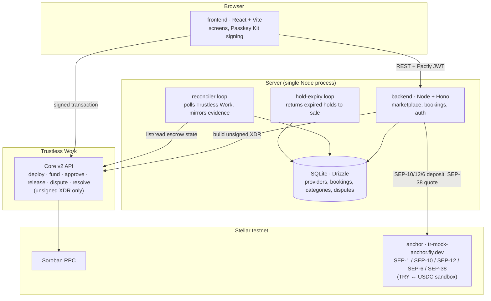

# Pactly

**A booking marketplace where the deposit sits in escrow neither side controls.**

   


A 14:00 consult at a hair clinic in Istanbul is a real hour. If the client does not show, the chair is dead for that slot. If the clinic takes the deposit first, someone booking from another country has sent a serious amount of money to a shop they have never walked into. Cards fail across borders. A cancellation policy does not actually collect. A bank transfer cannot hold the money in the middle. So today one side always eats it.

Pactly is the booking marketplace for that appointment. You find the clinic, you pick the slot, you lock a deposit. The deposit is not sitting in Pactly and it is not sitting in the shop. [Trustless Work](https://www.trustlesswork.com/) deploys a single-release escrow on Stellar for that exact booking: the client funds and later approves, the shop is the receiver, Pactly is only the resolver if they open a dispute. The shop cannot pull early. We cannot siphon it. It moves when the appointment is marked complete and the client says yes, or it comes back if they cancel inside the window. Every booking links the contract on Stellar Expert and Trustless Work's own Escrow Viewer, so the proof is not a screenshot we made.

The person doing this is not installing Freighter. They tap Continue with passkey. Face ID, through Stellar's [Passkey Kit](https://github.com/stellar/passkey-kit), creates a smart wallet and signs. No seed phrase, no wallet app. Every price on screen is in Turkish lira and the deposit is paid by a TRY bank transfer through the anchor (SEP-6); the USDC that actually sits in escrow is an implementation detail the client never sees.

**Live:** [pactly-phi.vercel.app](https://pactly-phi.vercel.app) · **Code:** [github.com/CemAyyildiz/Pactly](https://github.com/CemAyyildiz/Pactly)  
Genesis Track · Stellar testnet · USDC · Trustless Work · `tr-mock-anchor.fly.dev`

## Contents

- [Live demo](#live-demo)
- [Contract IDs and deployed artifacts](#contract-ids-and-deployed-artifacts)
- [Live status](#live-status)
- [Demo scenario](#demo-scenario)
- [Quick start](#quick-start)
- [Demo script](#demo-script)
- [Technical documentation](#technical-documentation)
  - [Overall architecture](#overall-architecture)
  - [Main components and their responsibilities](#main-components-and-their-responsibilities)
  - [Stellar integrations and protocols used](#stellar-integrations-and-protocols-used)
  - [Key design decisions and trade-offs](#key-design-decisions-and-trade-offs)
  - [Technical challenges and how we solved them](#technical-challenges-and-how-we-solved-them)
- [Repository layout](#repository-layout)
- [What's built](#whats-built)
- [Other commands](#other-commands)
- [Stack](#stack)
- [Hackathon requirements](#hackathon-requirements)
- [Planning documents](#planning-documents)
- [Skill files used](#skill-files-used)

## Live demo

| | URL |
|---|---|
| App | <https://pactly-phi.vercel.app> |
| Discover | <https://pactly-phi.vercel.app/discover> |
| Marmara Hair Clinic | <https://pactly-phi.vercel.app/providers/demo-marmara-hair-clinic> |

Continue with passkey (Face ID / fingerprint / device PIN). Discovery needs no sign-in.

## Contract IDs and deployed artifacts

Pactly does not ship one long-lived escrow WASM of its own. Every lock **deploys a new Trustless Work Core v2 single-release Soroban contract** on Stellar testnet; that `C…` id is persisted on the booking and linked from the UI (Stellar Expert + [Escrow Viewer](https://viewer.trustlesswork.com/)). The pre-pivot hand-written contract in `contracts/escrow/` is **not** in the runtime path (see [The pre-pivot Soroban contract](#the-pre-pivot-soroban-contract)).

| Artifact | Network | ID / hash |
|---|---|---|
| Trustless Work escrow | Stellar testnet | Per booking, created at **Lock with Pactly** — copy the contract id from the booking's escrow proof |
| Passkey Kit smart-wallet WASM (canonical, [deployments-2026-09-01](https://github.com/stellar/passkey-kit)) | Stellar testnet | `97ce047884106b1c6c3bb40b8973cc48db1c4dad95c9e20462bf2c701daa764e` |
| Passkey smart wallet | Stellar testnet | Per user, `C…` from **Continue with passkey** |
| Circle testnet USDC (issuer `GBBD47IF6LWK7P7MDEVSCWR7DPUWV3NY3DTQEVFL4NAT4AQH3ZLLFLA5`) | Stellar testnet SAC | `CBIELTK6YBZJU5UP2WWQEUCYKLPU6AUNZ2BQ4WWFEIE3USCIHMXQDAMA` |
| Anchor (TRY ↔ USDC sandbox) | SEP-1/6/10/12/38 | `tr-mock-anchor.fly.dev` |

## Live status

Everything below the escrow layer — discovery, provider profiles, the booking UI, the anchor deposit flow, the reconciler, the dispute/resolution screens — is built and exercised by tests. The one open item is the *first real signed lock against a live Trustless Work operator key*, tracked as Story 1.8:

| Check | Result |
|---|---|
| Backend reaches the anchor (`tr-mock-anchor.fly.dev`), resolves the USDC trustline via its `stellar.toml` | ✅ Verified live |
| Backend reaches Trustless Work's Core v2 API at the correct host | ✅ Fixed and verified 2026-09-20 — see below |
| A real `deploy()` call is accepted with the current operator API key | ⏳ Not yet — see below |
| Full lock → fund → complete → approve → release cycle against real testnet accounts | ⏳ Blocked on the item above |

**What we found, live, on 2026-09-20:** the installed `@trustless-work/escrow-js@1.0.0-beta.1` package hardcodes both its `development` and `mainNet` base URLs to `https://beta.api.trustlesswork.com` — `https://dev.api.trustlesswork.com`, which Trustless Work's own docs separately describe as a testnet host, doesn't exist in this package at all. A direct `deploy()` call against `dev.api.trustlesswork.com` returned a bare `404`; the same call against `beta.api.trustlesswork.com` reached the real route and returned a structured `401 AUTH_INVALID_CREDENTIAL` — i.e. the right door, wrong key. `TRUSTLESS_WORK_API_URL` is now set to `beta.api.trustlesswork.com` (`.env` and `.env.example`). What's left is reissuing or re-verifying the operator API key from [dapp.trustlesswork.com](https://dapp.trustlesswork.com) against that host, then re-running this same check.

Nothing about this affects the parts of the demo that don't need a real key: discovery, provider profiles, and holding a slot all work today with zero configuration (see [What's built](#whats-built)).

## Demo scenario

The hero story: **Aisha**, a client abroad, locks a meaningful deposit for an in-person hair-transplant consultation at Marmara Hair Clinic in Istanbul. Therapy, barber, salon, consulting and language-tutoring listings around it demonstrate that Pactly is not built for one profession. See [Demo script](#demo-script) for the exact steps and wallets.

## Quick start

### Prerequisites

| Tool | Version | Needed for |
|---|---|---|
| Node.js | 22 LTS (>= 22.12) | backend and frontend |
| npm | 10 or newer | workspaces |
| A device that can make a passkey (Safari, Chrome, Edge — Face ID / fingerprint / PIN) | [Passkey Kit](https://github.com/stellar/passkey-kit) smart wallet | signing; the backend fee-sponsors so the user holds no XLM |
| Rust (rustup) | 1.97.1, pinned in `rust-toolchain.toml` | `npm run setup:testnet` builds and deploys `contracts/escrow/` (the pre-pivot, undeployed-in-production contract — see below) with `cargo` whenever `ESCROW_CONTRACT_ID` is empty, which is `.env.example`'s own default — so a fresh clone running that command needs Rust too, unless you skip the build (see the note below the table) |
| Stellar CLI | current release — [install guide](https://developers.stellar.org/docs/tools/cli/install-cli) | `npm run setup:testnet`'s deploy step only; not needed to run the app |

**Skipping the Rust/Stellar CLI install:** nothing in the running app reads `ESCROW_CONTRACT_ID` (see [The pre-pivot Soroban contract](#the-pre-pivot-soroban-contract)), so you can set any validly-shaped placeholder before running `setup:testnet` and it will skip building and deploying the contract entirely, while still funding the demo accounts and trustlines you actually need:

```bash
echo "ESCROW_CONTRACT_ID=CAAAAAAAAAAAAAAAAAAAAAAAAAAAAAAAAAAAAAAAAAAAAAAAAAAAAAAA" >> .env
```

A real, funded Trustless Work operator key is needed for the deposit lock/fund/complete/approve/release/dispute/resolve steps to actually work — see [Trustless Work variables](#trustless-work-variables) below and [Live status](#live-status) above. Without one, discovery, provider profiles and holding a slot still work; every escrow action after that refuses up front with `503 ESCROW_UNAVAILABLE`.

### Install and run

```bash
npm install                 # installs every workspace (backend, frontend, scripts)
cp .env.example .env        # testnet defaults; PACTLY_AUTH_SIGNING_SECRET ships a random placeholder good for local dev only -- rotate it before deploying anywhere real
npm run demo:reset          # fresh database, migrated, seeded with 4 categories and 7 approved providers
npm run dev                 # backend + frontend together
```

- Backend: <http://localhost:3001/health> returns `{"status":"ok"}`.
- Frontend: <http://localhost:5173> shows the landing page; <http://localhost:5173/discover> shows the Discover page with the seeded providers.

The backend reads every variable once in `backend/src/config.ts` and exits, naming the variable, if one is missing from `.env`.

#### `npm run demo:reset`

A one-command rehearsal reset (Story 3.8): deletes the SQLite database file, reopens it (which migrates it, see `backend/src/db/client.ts`), reseeds the same demo dataset `seed:demo` uses, and prints every seeded provider's profile link plus which wallets the demo expects to be configured:

```bash
npm run demo:reset
```

This is what it prints on a fresh clone, right after `cp .env.example .env` (every variable still at its shipped default):

```
[demo:reset] upserted 4 categories and 7 providers
[demo:reset] SEED_PROVIDER_WALLET not set -- skipping the tester's own profile
[demo:reset] SEED_ADMIN_WALLET not set -- skipping the admin-resolver expectations check (see .env.example / README for Story 3.6's resolve action).
[demo:reset] done -- seeded provider links:
  http://localhost:5173/providers/demo-marmara-hair-clinic
  http://localhost:5173/providers/demo-elif-aydin
  http://localhost:5173/providers/demo-northside-barber
  http://localhost:5173/providers/demo-atelier-lale
  http://localhost:5173/providers/demo-kaan-demir
  http://localhost:5173/providers/demo-mehmet-can-yilmaz
  http://localhost:5173/providers/demo-zeynep-aksoy
[demo:reset] wallets the demo expects:
  SEED_PROVIDER_WALLET = (not set)
  SEED_ADMIN_WALLET = (not set)
  PACTLY_ADMIN_WALLETS = (not set)
  TRUSTLESS_WORK_PLATFORM_ADDRESS = (not set)
[demo:reset] Trustless Work variables are incomplete -- discovery, profiles and holding a slot still work; locking, funding, completing, releasing and resolving a deposit will 503 ESCROW_UNAVAILABLE until TRUSTLESS_WORK_API_URL, TRUSTLESS_WORK_API_KEY and TRUSTLESS_WORK_PLATFORM_ADDRESS are all set (see .env.example).
[demo:reset] if `npm run dev` is already running, restart the backend so it picks up the fresh database.
[demo:reset] ready
```

**If `npm run dev` is already running when you reset, restart the backend afterward.** It still has the old (now-deleted) database file open and keeps reading/writing it, so the freshly seeded data never shows up until it reopens the new one — the command's own last line says so.

Running it again is safe: the same categories, providers and slots come back, never duplicated. Set `SEED_PROVIDER_WALLET=G...` and `SEED_ADMIN_WALLET=G...` in `.env` first (see [Wallets and roles](#wallets-and-roles)) so the printed report tells you whether your own provider/admin wallets are actually wired up before you rehearse.

#### Trustless Work variables

Four variables exist in `.env`; they do not all gate the same thing (`backend/src/escrow/trustless-work/client.ts`):

| Variable | What it blocks when empty |
|---|---|
| `TRUSTLESS_WORK_API_URL` | Every escrow call (deploy, fund, complete, approve, release, dispute, resolve) — the adapter refuses before any network access |
| `TRUSTLESS_WORK_API_KEY` | Same as above — every escrow call |
| `TRUSTLESS_WORK_PLATFORM_ADDRESS` | Only `deploy` (the lock step) and `resolveDispute` (the resolve step) — the two calls that bake Pactly's own address into the role map |
| `TRUSTLESS_WORK_PLATFORM_ID` | Nothing — it is optional; when blank the adapter just omits the `X-TW-Platform` attribution header |

All three required variables stay empty until a real Trustless Work operator key exists, the same discipline the old `ESCROW_CONTRACT_ID` variable already used.

**`TRUSTLESS_WORK_API_URL` should be `https://beta.api.trustlesswork.com`.** Two hosts exist in the wild — the installed `@trustless-work/escrow-js@1.0.0-beta.1` package's own `development`/`mainNet` constant points at `https://beta.api.trustlesswork.com`, while Trustless Work's own docs separately describe `https://dev.api.trustlesswork.com` as a testnet host — and we verified directly (2026-09-20): a real `deploy()` call against `dev.api.trustlesswork.com` returns a bare `404` (no such route on that host, for this SDK version), while the same call against `beta.api.trustlesswork.com` reaches the real route (a structured `401 AUTH_INVALID_CREDENTIAL` on a bad key, not a `404`). `.env.example` carries this same note next to the variable. See [Live status](#live-status).

#### Wallets and roles

Every booking assigns each Trustless Work role explicitly (`backend/src/escrow/trustless-work/client.ts`):

| Role | Who |
|---|---|
| Funder / approver | the client |
| Service provider / release signer / receiver | the provider |
| Platform / dispute resolver / admin | Pactly (`TRUSTLESS_WORK_PLATFORM_ADDRESS`) |

`PACTLY_ADMIN_WALLETS` (comma-separated; with passkey sign-in these are the admins' `C…` smart-wallet addresses) grants the `/admin/applications` and `/admin/resolutions` screens; only the wallet that also equals `TRUSTLESS_WORK_PLATFORM_ADDRESS` can actually sign a resolution (every other admin wallet gets `403 NOT_DISPUTE_RESOLVER` if it tries). `SEED_PROVIDER_WALLET=G...` (your own wallet) additionally seeds an approved profile you can sign in as and edit at `/panel/availability`; `SEED_ADMIN_WALLET=G...` makes `demo:reset`/`seed:demo` tell you whether that wallet is actually configured as both an admin and the dispute resolver.

## Demo script

Seven steps a presenter can run through in about five minutes. Reset first (`npm run demo:reset`) and have two or three testnet wallets ready (client, provider, and Pactly's own resolver wallet for the last step). **If the backend was already running from `npm run dev`, restart it after the reset** — it keeps the old database file open otherwise and the fresh seed never shows up.

1. **Discover** (no wallet) — open <http://localhost:5173> (the landing page) and tap **Explore providers**, or go straight to <http://localhost:5173/discover>. Browse categories (therapy, education, consulting, fitness and beauty); each provider card shows the deposit pill (amount + free-cancellation window) and its next open slots.
2. **Provider profile** (no wallet) — open Marmara Hair Clinic's profile (`/providers/demo-marmara-hair-clinic`), the hero scenario. Pick a slot.
3. **Hold → pay by bank transfer → Lock with Pactly** (**client passkey**) — on the booking screen (`/book/:providerId?slot=...`), review the summary in lira, then **Sign in and hold this slot** (Face ID / fingerprint). The first sign-in deploys a [Passkey Kit](https://github.com/stellar/passkey-kit) smart wallet (~20 s). **Pay the deposit by bank transfer** opens a SEP-6 deposit against the hackathon sandbox (`tr-mock-anchor.fly.dev`); once the transfer is received, **Lock with Pactly** deploys and funds the escrow. Every prompt is a passkey assertion, not Freighter.
4. **My bookings** (**client wallet**) — <http://localhost:5173/me/bookings> shows the booking's escrow state (Funded) and balance state (unpaid) as two separate lines, plus the free-cancellation countdown.
5. **Pay the balance** (**client wallet**) — still on `/me/bookings`, tap **Pay balance**. This signs a plain Stellar USDC payment straight to the provider (not an escrow action), independent of the deposit; the balance line moves to "paid through Pactly". As the provider at `/panel/bookings`, **Mark paid in person** is the alternative when a client pays in cash instead.
6. **Complete → approve → release** (**provider wallet**, then **client wallet**, then **provider wallet**) — sign in as the provider at `/panel/bookings` and tap **Mark appointment complete**; sign in as the client at `/me/bookings` and tap **Approve**; back as the provider, tap **Release deposit**. Both sides read **Released** once the reconciler confirms it.
7. **Resolution (optional branch)** (**either wallet**, then **Pactly's resolver wallet**) — before releasing, either side can tap **Open a dispute** on their own booking row; the screen states the booking-policy outcome in words first. Sign in with the wallet that is both listed in `PACTLY_ADMIN_WALLETS` and equal to `TRUSTLESS_WORK_PLATFORM_ADDRESS`, open `/admin/resolutions`, and resolve it. Both sides then read **Resolved**.

The client never needs a wallet before step 3; the whole flow avoids implementation vocabulary (Soroban, trustline, SEP-6, milestone, hash and smart contract never appear on screen).

## Technical documentation

This section is the technical write-up: how the system is put together, which Stellar protocols it uses, why it is shaped the way it is, and what broke on the way. Live deployment: <https://pactly-phi.vercel.app> (Vite build + the same Hono backend as a Vercel function under `/api`, SQLite on the function's `/tmp`).

### Overall architecture

Two stores, one rule: **Stellar is the money. SQLite is the marketplace.** Categories, profiles, slots and holds live in the database. Escrow state (`escrow_state`) is written only after the reconciler reads a Trustless Work contract on testnet. If the two disagree, the chain wins.

A lock is three steps. The backend asks Trustless Work for an unsigned deploy, then an unsigned fund. The browser signs both with Passkey Kit (Face ID). After submit, the UI polls until the reconciler has seen the contract funded. The seal does not stamp on our say-so.



### Main components and their responsibilities

| Component | Path | Responsibility |
|---|---|---|
| Screens | `frontend/src/pages`, `frontend/src/components` | Discover, profile, booking, My bookings, "List your shop" application, provider panel, admin queues. No Soroban words on screen; every amount rendered in TRY through `TryAmount` (`GET /rate`). |
| Passkey Kit | `frontend/src/wallet/index.ts` | Create / reconnect a `C…` smart wallet, sign Soroban auth entries with Face ID. |
| Passkey fee-sponsor | `backend/src/auth/passkeyKit.ts` | Rebuild the kit's deployment carrier into an envelope this backend sources and pays for (friendbot-funded testnet payer), or hand it to an OpenZeppelin relayer when configured. Issues the Pactly JWT bound to the contract id. |
| HTTP API | `backend/src/app.ts` | Holds, lock/fund/complete/approve/release/dispute/resolve, TRY deposit, balance pay, provider applications, admin decisions, TRY rate. Returns `{code, message}`. |
| Provider onboarding | `backend/src/services/providerApplications.ts` | Application creates an unapproved profile (panel usable while pending, never listed); admin approve flips `is_approved`, reject records a reason and allows re-application. |
| Vercel entry | `api/[[...route]].ts`, `backend/src/boot.ts` | Same Hono app mounted at `/api`; hold-expiry and reconciler ticks run once per booking request instead of on a timer, because a function has no background loop. |
| Booking service | `backend/src/services/booking.ts` | Slot hold, persist predicted `contractId`, keep `escrow_state` and `balance_state` apart. |
| Trustless Work adapter | `backend/src/escrow/trustless-work/` | Build unsigned XDR only. Role map: client = funder + approver, shop = receiver + release signer, Pactly = platform + dispute resolver. |
| Reconciler | `backend/src/escrow/trustless-work/reconciler.ts` | Poll only contract ids we persisted. Derive funded / approved / disputed / released / resolved from TW's read model. |
| Anchor client | `backend/src/anchor/` | `stellar.toml`, SEP-10, SEP-12, SEP-6 deposit, SEP-38 quote. USDC issuer comes from the toml, not a hardcoded constant. |
| Balance payment | `backend/src/payments/stellar.ts` | Plain USDC payment shop-ward, separate from escrow, submitted on Soroban RPC. |
| SQLite | `backend/src/db/` | Marketplace rows. Never invents escrow money state. |

### Stellar integrations and protocols used

| Integration | Protocol / product | What Pactly uses it for |
|---|---|---|
| [Passkey Kit](https://github.com/stellar/passkey-kit) | WebAuthn smart wallet on Soroban | Identity and every escrow signature. WASM `97ce0478…764e`. No Freighter. |
| [Trustless Work](https://www.trustlesswork.com/) Core v2 | Soroban single-release escrow, `@trustless-work/escrow-js` | The deposit. One contract per booking, deployed at lock. |
| Anchor `tr-mock-anchor.fly.dev` | SEP-1, SEP-10, SEP-12, SEP-6, SEP-38 | TRY in, USDC out, then the same Trustless Work lock. SEP-38 also feeds `GET /rate`, the TRY-per-USDC price every screen converts with. |
| Circle testnet USDC | Stellar Asset Contract | Escrow token. Issuer `GBBD47IF…FLA5`, SAC `CBIELTK6…DAMA`. |
| Soroban RPC | `https://soroban-testnet.stellar.org` | Passkey submit / fee-bump, and the independent balance payment. |

SEP-6 is the local-currency rail. SEP-10/12/38 exist to open that deposit honestly (auth, KYC auto-approve on the sandbox, a quote so TRY 2 dp and USDC 7 dp do not collide). We do not pretend SEP-24/31 are in the product.

### Key design decisions and trade-offs

**Trustless Work instead of `contracts/escrow/`.** The first week we wrote our own Soroban escrow. Genesis scoring is integration-weighted, and a booking already *is* an escrow. TW's single-release contract is that escrow: we map roles and stop maintaining WASM. Cost: one `C…` per booking, not a Pactly factory we own. The old contract stays in the tree, unused, tests still run. See [The pre-pivot Soroban contract](#the-pre-pivot-soroban-contract).

**Passkey Kit instead of Freighter.** The booking is for someone who will not install a wallet. Face ID is the signer. Cost: identity is a contract account; friendbot cannot fund it; we fee-sponsor. Classic `G…` SEP-10 is no longer how a client logs in.

**Unsigned XDR on the server, always.** The backend builds, the passkey signs, we submit. A stolen API process cannot move the deposit. Cost: every money step is a device prompt.

**Two states on a booking.** `escrow_state` is chain. `balance_state` is the rest of the invoice (USDC to the shop, or marked paid in person). They never overwrite each other.

**TRY pay-in, not cash-out.** SEP-6 deposit against the hackathon sandbox is the Genesis local-payments bar. Shop withdrawal in TRY is Story 2.3 and is not in this build.

**TRY on screen, USDC underneath.** Prices, deposits and balances are stored as USDC smallest-unit integer strings (never floats) and converted for display with the anchor's indicative rate (`GET /rate`, cached 60 s, last-good value on failure). A provider types a lira price; the frontend converts at the rate on screen before saving. Cost: a price saved at one rate and read at another can drift by a kuruş, and a stored amount is exact only in USDC. We accepted that over storing TRY, which would have put a fiat number into an on-chain escrow that only holds USDC.

**Applying creates the profile, unapproved.** "List your shop" writes an application *and* an unapproved profile at once, so the applicant's panel opens immediately (with a pending banner) and slots can be set before approval; the marketplace and search already filter on `is_approved`, so nothing leaks. Approval flips one bit. Cost: rejected profiles stay in the table (unlisted) rather than being deleted.

**A stateless deployment on purpose.** The live app runs the whole backend as one Vercel function with SQLite on `/tmp`: a cold start reseeds the demo listings and forgets bookings. That is fine for a judged demo and costs nothing; a persistent database is the first thing to change for real users.

### Technical challenges and how we solved them

**TW's documented testnet host 404s.** `@trustless-work/escrow-js@1.0.0-beta.1` points `development` and `mainNet` at `beta.api.trustlesswork.com`. Docs also mention `dev.api.trustlesswork.com`. We called both: `dev` returned a bare 404, `beta` hit a real route (`401` on a bad key). Runtime uses `beta`. Details under [Live status](#live-status).

**TRY 2 dp, USDC 7 dp.** Opening SEP-6 with a 7-dp amount 502'd. We take a SEP-38 quote and round the TRY side with `toTwoDecimalPlaces` before the deposit.

**Passkey Kit peers stellar-sdk 16, the rest of the app was 17.** Two SDK copies make every `instanceof` XDR check inside the kit fail. Frontend is on 16 and Vite `dedupe`s onto that copy. Soroban `auth` entries are signed in the browser (`signAuthEntry`). A classic `G…` envelope from TW would throw `PASSKEY_KIT_SIGN` rather than fall back to a custodial seed.

**Kit 0.19.1 decodes a missing signer expiry as `null`.** `connectWallet` then does `null.toString()` and dies. `frontend/src/wallet/index.ts` rewrites that `null` to `undefined` so reconnect works.

**The kit's deploy "carrier" cannot be submitted as is.** Its envelope source is the shared, sign-only deployer, so a plain fee-bump is rejected. Without an OpenZeppelin relayer key we do what a relayer does: take the single host function and its already-signed auth entries out of the carrier, build a fresh envelope sourced by our friendbot-funded testnet payer, simulate, sign, submit, poll (`backend/src/auth/passkeyKit.ts`). Every one of these was found by driving the real ceremony headlessly with a CDP virtual authenticator, not by reading docs.

**Three separate reasons the Vercel function crashed with one error.** `FUNCTION_INVOCATION_FAILED` hid: the `api/` entry compiled to CommonJS while the backend is ESM (`api/package.json` sets `"type": "module"`); npm's new allow-scripts policy silently skipped `better-sqlite3`'s native build (`allowScripts` in `package.json`); and deep links like `/discover` 404'd without an SPA rewrite. The runtime log stream, not the build log, showed the first one.

**Lira input in the wild.** "1.200,50", "1,200.50", "1200,5" and "₺1 200" are all the same price to a Turkish user. `normaliseTryInput` decides thousands-vs-decimal separator by position and digit count before converting to USDC, and the form refuses to post an amount it could not parse instead of surfacing the backend's smallest-unit error.

**Load-bearing rules**

| Rule | What it buys |
|---|---|
| `escrow_state` is written only from reconciled Trustless Work evidence, never from a request alone | The backend and the chain cannot silently diverge |
| Every escrow action is signed by the wallet holding that Trustless Work role (client, provider or Pactly) | Pactly cannot move money on a user's behalf; a stranger cannot advance someone else's booking |
| A booking carries two independent states: `escrow_state` (chain) and `balance_state` (backend) | The deposit and the balance never overwrite each other |
| The backend only ever builds unsigned XDR; it never holds a signing key for a client or provider | A compromised backend cannot move a client's or provider's funds |

The long-form AD log is [`ARCHITECTURE-SPINE.md`](_bmad-output/planning-artifacts/architecture/architecture-Pactly-2026-09-16/ARCHITECTURE-SPINE.md). Escrow-runtime pages there predate the Trustless Work pivot; the diagram and tables above are the runtime.

### The pre-pivot Soroban contract

`contracts/escrow/` is a hand-written Soroban escrow from before we switched to Trustless Work. **It is not deployed and nothing in the running app calls it.** Tests still run under `npm run contracts:test`. `backend/src/chain/` and `ESCROW_CONTRACT_ID` are the same leftover. `SOROBAN_RPC_URL` is live: balance payments and passkey fee-bumps use it.

## Repository layout

```text
contracts/escrow/   # pre-pivot Soroban escrow contract (Rust) -- kept as a record, not deployed
backend/            # Node.js + TypeScript: marketplace, bookings, Trustless Work adapter + reconciler
frontend/           # React + TypeScript + Vite
scripts/            # testnet account/trustline funding (npm run setup:testnet)
```

## What's built

Built against [`sprint-status.yaml`](_bmad-output/implementation-artifacts/sprint-status.yaml) and each story's own spec frontmatter — a row is "Built" only when both agree and the actual code (routes, services, frontend screens) backs them up.

| Capability | Status | Notes |
|---|---|---|
| Discovery, categories, search, filters (Stories 3.1–3.3) | **Built** | No sign-in; ≥6 approved seed providers across 4 categories |
| Provider profile, availability panel (Story 3.1) | **Built** | Deposit pill, open slots, wallet sign-in only for the provider's own panel |
| Marketing landing page at `/` | **Built** | Hero, how-it-works, demo scenario, category tiles, "built with"; `/discover` carries the marketplace itself |
| Slot hold + Lock with Pactly (Story 3.4) | **Built** | Backend-issued 10-minute hold; deploy + fund XDR signed by the client; confirmation only after reconciled chain evidence |
| Two-sided status panel, countdown, explorer link (Story 3.5) | **Built** | `escrow_state`/`balance_state` always shown separately; every proof point also links Trustless Work's own [Escrow Viewer](https://viewer.trustlesswork.com/) |
| Complete → approve → release, dispute → resolve (Story 3.6) | **Built** | `backend/src/app.ts`'s `/bookings/:id/{complete,approve,release,dispute}` and `/admin/bookings/:id/resolve`, wired to `frontend/src/components/BookingActions.tsx` |
| Paying the balance before the session (Story 3.7) | **Built** | The client pays the balance in USDC directly to the provider (`POST /bookings/:id/balance/pay`+`/submit`, a plain Stellar payment independent of the escrow — `backend/src/payments/stellar.ts`); the provider can mark it paid in person (`/bookings/:id/balance/mark-cash`); both panels show unpaid / paid through Pactly / paid in person |
| Local-currency pay-in / cash-out via SEP-6 (Stories 2.2–2.4) | **Pay-in built; cash-out not built** | A client on the booking screen can pay the deposit in TRY via the hackathon sandbox (`tr-mock-anchor.fly.dev`): SEP-10 in their wallet, SEP-12 (auto-approved), SEP-6 deposit, then Lock with Pactly once the USDC lands. Provider cash-out (Story 2.3) is not built yet. |
| Trustless Work live compatibility, real operator key (Story 1.8) | **In progress** | The adapter and reconciler are built and unit-tested against a fake Trustless Work server; the API host is now verified reachable (see [Live status](#live-status)), but no lock, release or resolve has yet run against a real, accepted operator key on testnet |
| Provider application + admin approval queue (Stories 4.1–4.2) | **Built** | "List your shop" (`/providers/apply`) collects the shop, session, TRY price, deposit rate and cancellation window; the applicant's panel opens at once with a pending banner; admins approve or reject with a reason at `/admin/applications` (`backend/src/services/providerApplications.ts`, 4 HTTP tests) |
| Reviews, verified-session counter (Epic 4) | **Not built** | Vision-scoped, not started |

## After the hackathon (roadmap)

**Soon — earn on your escrow money.** While a deposit waits for the appointment, that USDC could supply on [XOXNO](https://github.com/XOXNO/rs-lending-xlm/tree/main/skills) instead of sitting idle. Client opt-in at lock, off by default: the shop still receives the exact deposit on release; the client keeps any yield. Trustless Work's current single-release contract cannot do this internally (yield-aware wrapper or TW strategy hook). Not in this build.

Ordered on purpose — cash-out first, then that item:

1. **Provider cash-out (Story 2.3)** — SEP-6 withdraw so a released deposit can leave Stellar as TRY. Load-bearing for the same anchor already used on pay-in.
2. **Optional yield on a locked deposit** — as above. Not for TRY-pay-in users until the USDC has actually landed and the risk copy is on screen.

Do not auto-yield every lock. A 6-hour barber hold is not worth the risk; a 72-hour clinic deposit is the case that earns it.

## Other commands

```bash
npm run -w backend seed:demo   # same seed data as demo:reset, without deleting the database first
npm run build                  # type-check and build backend and frontend
npm test                       # contract tests, then any workspace tests
npm run -w backend typecheck   # backend type-check only
npm run contracts:test         # cargo test in contracts/escrow (the pre-pivot contract)
npm run contracts:build        # release wasm build of the pre-pivot contract
npm run --silent setup:testnet # fund demo accounts/trustlines -- see scripts/README.md
```

## Stack

| Layer | Choice |
|---|---|
| Backend | Node.js 22 · TypeScript · Hono 4 · Drizzle ORM · SQLite (better-sqlite3) |
| Escrow | `@trustless-work/escrow-js` (Trustless Work Core v2 API) |
| Frontend | React 19 · Vite 8 · React Router 7 · TanStack Query 5 · `motion` (reduced-motion-aware entrance animation) · Phosphor icons · plain CSS design tokens ("Editorial Warmth") |
| Stellar | `@stellar/stellar-sdk` 17 (backend) / 16 (frontend, Passkey Kit's peer) · [Passkey Kit](https://github.com/stellar/passkey-kit) 0.19 |
| Hosting | Vercel — static Vite build + one Node function for the API (`vercel.json`, `api/`) |
| Contract (pre-pivot, undeployed) | Rust · soroban-sdk 27.0.6 |

## Hackathon requirements

Pactly is submitted to the **Genesis Track**. Mapped against the organizers' own bar (full text: [`pro-hackathon-2026-handbook.md`](_bmad-output/planning-artifacts/pro-hackathon-2026-handbook.md)):

| Requirement | Where it's satisfied |
|---|---|
| Eligible integration, load-bearing (not an add-on) | [Trustless Work](https://www.trustlesswork.com/) escrow is the core of every booking — see [Architecture](#technical-documentation); pending the live-key fix in [Live status](#live-status) |
| Real anchor / local-payments rail (highest-weighted criterion) | SEP-1/6/10/12/38 against `tr-mock-anchor.fly.dev` — a client pays a real TRY deposit and receives usable USDC balance (Story 2.4, [What's built](#whats-built)) |
| Testnet-deployed, end-to-end flows, not hardcoded | Stellar testnet throughout; live app at [pactly-phi.vercel.app](https://pactly-phi.vercel.app). Escrow contracts are Trustless Work Soroban deployments per lock; Passkey Kit wallet WASM and USDC SAC ids are in [Contract IDs](#contract-ids-and-deployed-artifacts). `contracts/escrow/` is unused and not presented as deployed |
| Stellar Skills referenced with a path | [Skill files used](#skill-files-used) below |
| Documented architecture, decisions and trade-offs | [Technical documentation](#technical-documentation) — overall architecture, components, Stellar integrations, design decisions, technical challenges |
| Understandable UX for someone new to crypto | Implementation vocabulary (Soroban, XDR, trustline, milestone) never appears on screen — see the [Demo script](#demo-script)'s closing note |
| Setup and test instructions | [Quick start](#quick-start), [Other commands](#other-commands) |
| Traction & continuity (post-hackathon roadmap) | [After the hackathon](#after-the-hackathon-roadmap) — cash-out, then optional yield on locked deposits (not in this build) |

## Planning documents

| Document | Contents |
|---|---|
| [`prd.md`](_bmad-output/planning-artifacts/prd.md) | Product requirements (v1.2), epics and stories |
| [`ARCHITECTURE-SPINE.md`](_bmad-output/planning-artifacts/architecture/architecture-Pactly-2026-09-16/ARCHITECTURE-SPINE.md) | Architecture decisions (AD-1…AD-14), consistency conventions |
| [`DESIGN.md`](_bmad-output/planning-artifacts/ux-designs/ux-Pactly-2026-09-15/DESIGN.md) | Visual system spec — the "Editorial Warmth" direction the app ships with (warm paper, Newsreader + Instrument Sans, Pactly blue and escrow black as the trust colours, Phosphor icons; see the screenshot at the top of this README) |
| [`EXPERIENCE.md`](_bmad-output/planning-artifacts/ux-designs/ux-Pactly-2026-09-15/EXPERIENCE.md) | Information architecture, states, copy rules, flows |
| [`sprint-status.yaml`](_bmad-output/implementation-artifacts/sprint-status.yaml) | Per-story tracking status |
| [`deferred-work.md`](_bmad-output/implementation-artifacts/deferred-work.md) | Parked follow-ups (includes XOXNO yield on locked deposits) |

## Skill files used

As required by the hackathon, planning and delivery were run with BMAD Method skills:

| Skill | Path |
|---|---|
| [Passkey Kit](https://github.com/stellar/passkey-kit) | `frontend/src/wallet/index.ts`, `backend/src/auth/passkeyKit.ts` — WebAuthn smart wallet (`C…`); no Freighter |
| Anchors (SEP-1/6/10/12/38) | `backend/src/anchor/` — discovery, auth, quote, KYC, TRY deposit against `tr-mock-anchor.fly.dev` |
| [Trustless Work Skill](https://docs.trustlesswork.com/trustless-work/ai/skill) | `backend/src/escrow/trustless-work/` — role map, single-release escrow lifecycle, `@trustless-work/escrow-js` adapter |
| [XOXNO Lending skills](https://github.com/XOXNO/rs-lending-xlm/tree/main/skills) | **Roadmap, not this build** — optional yield on a locked deposit; see [After the hackathon](#after-the-hackathon-roadmap) |
| bmad-prd | `.claude/skills/bmad-prd/SKILL.md` |
| bmad-ux | `.claude/skills/bmad-ux/SKILL.md` |
| ui-ux-pro-max | `.claude/skills/ui-ux-pro-max/SKILL.md` |
| bmad-architecture | `.claude/skills/bmad-architecture/SKILL.md` |
| bmad-sprint-planning | `.claude/skills/bmad-sprint-planning/SKILL.md` |
| bmad-build | `.claude/skills/bmad-build/SKILL.md` |
| bmad-correct-course | `.claude/skills/bmad-correct-course/SKILL.md` |
| bmad-retrospective | `.claude/skills/bmad-retrospective/SKILL.md` |
