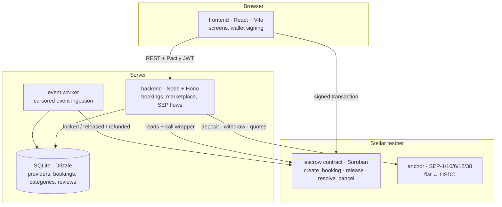

# Pactly

A trust-backed booking marketplace for appointment-based services. The deposit is locked in a Stellar contract neither side controls: it goes to the provider when the session happens, and back to the client when they cancel in time.

**Event:** Rise In × Stellar Pro Hackathon 2026 — Genesis Track
**Network:** Stellar testnet · **Asset:** USDC · **Anchor:** `tr-mock-anchor.fly.dev`

> Status: planning complete, implementation starting. The setup steps below are verified as the code lands.

## The problem

In every appointment-based profession, the product is time. When a client does not show up, that hour cannot be resold. If the provider asks for prepayment, the risk simply moves to the client: sending money up front to someone you have never met, often in another country, takes trust.

Pactly holds the deposit somewhere neither side can reach. The contract enforces the rule, not the parties.

## How it works

1. A client finds a provider on the marketplace and picks a slot.
2. They pay the deposit from their wallet (USDC) or in local currency; the amount locks in a Soroban contract.
3. If the session happens, the client confirms and the deposit is released to the provider.
4. Cancel in time and the deposit is refunded; cancel late or no-show and it transfers to the provider.
5. The provider cashes out in local currency through SEP-6. They never need to know anything about crypto.

## Architecture

Paradigm: **chain-authoritative layered services**. The contract is the sole authority on money state; the backend mirrors it; the frontend presents and signs.



**Load-bearing rules**

| Rule | What it buys |
|---|---|
| Money state is written only from a chain event | The backend and the contract cannot silently diverge |
| `release` needs the client's signature; `resolve_cancel` is permissionless | Pactly cannot move money on a user's behalf, and a no-show never strands the provider |
| A booking carries two states: deposit and balance | Two different payments never overwrite each other |
| Marketplace data lives only in the database, deposits only on chain | One record of truth per fact |
| The "verified sessions" count only increases on a `released` event | The quality signal cannot be fabricated |

Full set with rationale: [`ARCHITECTURE-SPINE.md`](_bmad-output/planning-artifacts/architecture/architecture-Pactly-2026-09-16/ARCHITECTURE-SPINE.md)

## Repository layout

```text
contracts/escrow/   # Soroban escrow contract (Rust)
backend/            # Node.js + TypeScript: marketplace, SEP integrations, event worker
frontend/           # React + TypeScript + Vite
scripts/            # testnet funding, trustlines, deployment, seed data
```

## Setup (planned)

Requirements: Node.js 22 LTS, Rust toolchain with the `wasm32v1-none` target, Stellar CLI.

```bash
npm install                 # backend + frontend dependencies
npm run setup:testnet       # test accounts, trustlines, contract deploy → .env
npm run dev                 # backend + frontend together
```

Contract tests:

```bash
cd contracts/escrow && cargo test
```

## Stack

| Layer | Choice |
|---|---|
| Contract | Rust · soroban-sdk 27.0.6 |
| Backend | Node.js 22 · TypeScript · Hono 4 · Drizzle ORM · SQLite |
| Frontend | React 19 · Vite 8 · TanStack Query 5 · Motion 13 |
| Stellar | @stellar/stellar-sdk 17 · Stellar Wallets Kit 2.6 |

## Planning documents

| Document | Contents |
|---|---|
| [`prd.md`](_bmad-output/planning-artifacts/prd.md) | Product requirements (v1.2), epics and stories |
| [`ARCHITECTURE-SPINE.md`](_bmad-output/planning-artifacts/architecture/architecture-Pactly-2026-09-16/ARCHITECTURE-SPINE.md) | Architecture decisions (AD-1…AD-14), consistency conventions |
| [`DESIGN.md`](_bmad-output/planning-artifacts/ux-designs/ux-Pactly-2026-09-15/DESIGN.md) | Visual system: colour rule, typography, components |
| [`EXPERIENCE.md`](_bmad-output/planning-artifacts/ux-designs/ux-Pactly-2026-09-15/EXPERIENCE.md) | Information architecture, states, copy rules, flows |

## Skill files used

As required by the hackathon, planning was run with BMAD Method skills:

| Skill | Path |
|---|---|
| bmad-ux | `.claude/skills/bmad-ux/SKILL.md` |
| bmad-prd | `.claude/skills/bmad-prd/SKILL.md` |
| bmad-architecture | `.claude/skills/bmad-architecture/SKILL.md` |
| bmad-sprint-planning | `.claude/skills/bmad-sprint-planning/SKILL.md` |
| ui-ux-pro-max | `.claude/skills/ui-ux-pro-max/SKILL.md` |
