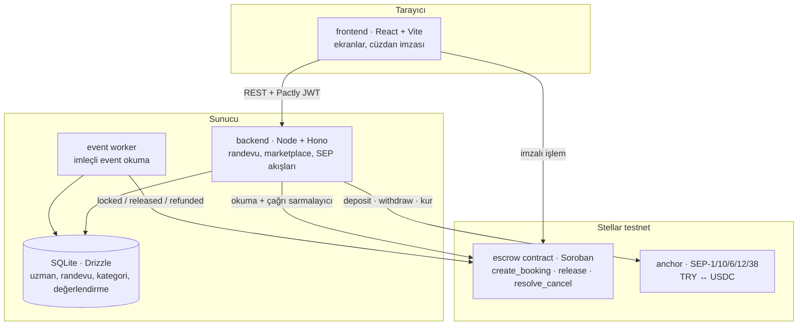

# Pactly

Randevulu hizmetler için güvenceli randevu marketplace'i. Kapora, taraflardan bağımsız bir Stellar sözleşmesinde kilitlenir; görüşme gerçekleşince uzmana geçer, zamanında iptalde danışana döner.

**Etkinlik:** Rise In × Stellar Pro Hackathon 2026 — Genesis Track
**Ağ:** Stellar testnet · **Varlık:** USDC · **Anchor:** `tr-mock-anchor.fly.dev`

> Durum: planlama tamamlandı, geliştirme başlıyor. Aşağıdaki kurulum adımları kod yazıldıkça doğrulanacak.

## Sorun

Randevuyla çalışan her meslekte ürün zamandır. Müşteri gelmediğinde o saat geri satılamaz. Profesyonel önden ödeme isterse bu kez risk danışana geçer: tanımadığı birine, çoğu zaman başka bir şehirde ya da ülkede, önden para göndermek güven ister.

Pactly kaporayı ikisinin de dokunamadığı bir emanette tutar. Kuralı sözleşme uygular, taraflar değil.

## Nasıl çalışır

1. Danışan marketplace'ten uzman bulur ve bir saat seçer.
2. Kaporayı cüzdanıyla (USDC) ya da Türk Lirası ile öder; tutar Soroban sözleşmesinde kilitlenir.
3. Görüşme gerçekleşirse danışan onaylar, kapora uzmana geçer.
4. Zamanında iptalde kapora danışana iade edilir; geç iptal ya da katılmama durumunda uzmana aktarılır.
5. Uzman kazancını SEP-6 ile Türk Lirası olarak çeker. Hiçbir adımda kripto bilmesi gerekmez.

## Mimari

Paradigma: **zincir-otoriteli katmanlı hizmet**. Para durumunun tek otoritesi sözleşmedir; backend onun aynasıdır; frontend sunum ve imza katmanıdır.



**Taşıyıcı kurallar**

| Kural | Ne sağlar |
|---|---|
| Para durumu yalnızca zincir event'i ile yazılır | Backend ile sözleşme sessizce ayrışamaz |
| `release` danışanın imzasını ister, `resolve_cancel` izinsizdir | Pactly kullanıcı adına para hareketi başlatamaz; no-show'da uzman kilitli kalmaz |
| Randevu iki ayrı durum taşır: kapora ve kalan tutar | İki farklı ödeme birbirini ezmez |
| Marketplace verisi yalnızca veritabanında, kapora yalnızca zincirde | Tek kayıt yeri, çift gerçek yok |
| "Doğrulanmış seans" sayacı yalnızca `released` event'i ile artar | Kalite sinyali uydurulamaz |

Tam liste ve gerekçeler: [`ARCHITECTURE-SPINE.md`](_bmad-output/planning-artifacts/architecture/architecture-Pactly-2026-09-16/ARCHITECTURE-SPINE.md)

## Depo yapısı

```text
contracts/escrow/   # Soroban escrow contract (Rust)
backend/            # Node.js + TypeScript: marketplace, SEP entegrasyonları, event worker
frontend/           # React + TypeScript + Vite
scripts/            # testnet fonlama, trustline, deploy, örnek veri
```

## Kurulum (planlanan)

Gereksinimler: Node.js 22 LTS, Rust toolchain + `wasm32v1-none` hedefi, Stellar CLI.

```bash
npm install                 # backend + frontend bağımlılıkları
npm run setup:testnet       # test hesapları, trustline, contract deploy → .env
npm run dev                 # backend + frontend birlikte
```

Sözleşme testleri:

```bash
cd contracts/escrow && cargo test
```

## Teknoloji

| Katman | Seçim |
|---|---|
| Sözleşme | Rust · soroban-sdk 27.0.6 |
| Backend | Node.js 22 · TypeScript · Hono 4 · Drizzle ORM · SQLite |
| Frontend | React 19 · Vite 8 · TanStack Query 5 · Motion 13 |
| Stellar | @stellar/stellar-sdk 17 · Stellar Wallets Kit 2.6 |

## Planlama dokümanları

| Doküman | İçerik |
|---|---|
| [`prd.md`](_bmad-output/planning-artifacts/prd.md) | Ürün gereksinimleri (v1.1), epic ve story listesi |
| [`ARCHITECTURE-SPINE.md`](_bmad-output/planning-artifacts/architecture/architecture-Pactly-2026-09-16/ARCHITECTURE-SPINE.md) | Mimari kararlar (AD-1…AD-14), tutarlılık sözleşmeleri |
| [`DESIGN.md`](_bmad-output/planning-artifacts/ux-designs/ux-Pactly-2026-09-15/DESIGN.md) | Görsel sistem: renk kuralı, tipografi, bileşenler |
| [`EXPERIENCE.md`](_bmad-output/planning-artifacts/ux-designs/ux-Pactly-2026-09-15/EXPERIENCE.md) | Bilgi mimarisi, durumlar, metin kuralları, akışlar |

## Kullanılan skill dosyaları

Hackathon şartı gereği, planlama BMAD Method skill'leri ile yürütüldü:

| Skill | Yol |
|---|---|
| bmad-ux | `.claude/skills/bmad-ux/SKILL.md` |
| bmad-prd | `.claude/skills/bmad-prd/SKILL.md` |
| bmad-architecture | `.claude/skills/bmad-architecture/SKILL.md` |
| ui-ux-pro-max | `.claude/skills/ui-ux-pro-max/SKILL.md` |
