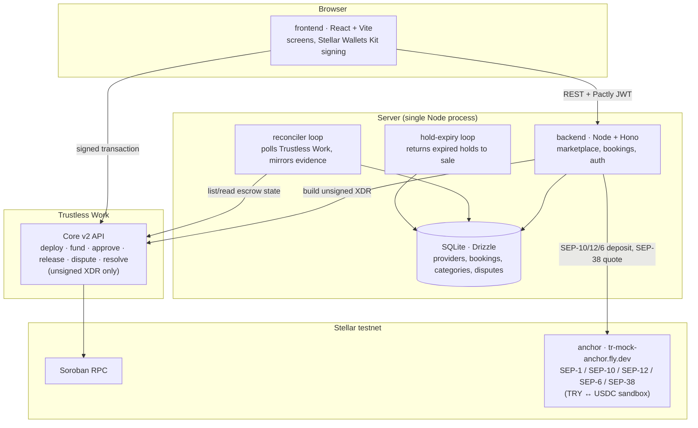

# Pactly

Pactly is a trust-backed booking marketplace for appointment-based services. A client finds a provider, picks a slot and locks a deposit in an escrow neither side controls; the deposit releases to the provider when the appointment happens, or back to the client on a timely cancellation — with a transparent, chain-backed resolution path when the two sides disagree.

**Event:** Rise In × Stellar Pro Hackathon 2026 — Genesis Track
**Network:** Stellar testnet · **Asset:** USDC · **Escrow:** [Trustless Work](https://www.trustlesswork.com/) · **Anchor:** `tr-mock-anchor.fly.dev`

> Status: implementation in progress (Epic 3 of 4). See [What's built](#whats-built) for exactly which parts are real today.

## Demo scenario

The hero story: **Aisha**, a client abroad, locks a meaningful deposit for an in-person hair-transplant consultation at Marmara Hair Clinic in Istanbul. Therapy, barber, salon, consulting and language-tutoring listings around it demonstrate that Pactly is not built for one profession. See [Demo script](#demo-script) for the exact steps and wallets.

## Prerequisites

| Tool | Version | Needed for |
|---|---|---|
| Node.js | 22 LTS (>= 22.12) | backend and frontend |
| npm | 10 or newer | workspaces |
| A Stellar testnet wallet (e.g. [Freighter](https://www.freighter.app/)) | any [Stellar Wallets Kit](https://stellarwalletskit.dev/)-supported wallet | signing every booking/escrow action; holds testnet XLM for fees and the anchor's testnet USDC (trustline + balance) |
| Rust (rustup) | 1.97.1, pinned in `rust-toolchain.toml` | `npm run setup:testnet` builds and deploys `contracts/escrow/` (the pre-pivot, undeployed-in-production contract — see below) with `cargo` whenever `ESCROW_CONTRACT_ID` is empty, which is `.env.example`'s own default — so a fresh clone running that command needs Rust too, unless you skip the build (see the note below the table) |
| Stellar CLI | current release — [install guide](https://developers.stellar.org/docs/tools/cli/install-cli) | `npm run setup:testnet`'s deploy step only; not needed to run the app |

**Skipping the Rust/Stellar CLI install:** nothing in the running app reads `ESCROW_CONTRACT_ID` (see [The pre-pivot Soroban contract](#the-pre-pivot-soroban-contract)), so you can set any validly-shaped placeholder before running `setup:testnet` and it will skip building and deploying the contract entirely, while still funding the demo accounts and trustlines you actually need:

```bash
echo "ESCROW_CONTRACT_ID=CAAAAAAAAAAAAAAAAAAAAAAAAAAAAAAAAAAAAAAAAAAAAAAAAAAAAAAA" >> .env
```

A real, funded Trustless Work operator key is needed for the deposit lock/fund/complete/approve/release/dispute/resolve steps to actually work — see [Trustless Work variables](#trustless-work-variables) below. Without one, discovery, provider profiles and holding a slot still work; every escrow action after that refuses up front with `503 ESCROW_UNAVAILABLE`.

## Install and run

```bash
npm install                 # installs every workspace (backend, frontend, scripts)
cp .env.example .env        # testnet defaults; PACTLY_AUTH_SIGNING_SECRET ships a random placeholder good for local dev only -- rotate it before deploying anywhere real
npm run demo:reset          # fresh database, migrated, seeded with 4 categories and 7 approved providers
npm run dev                 # backend + frontend together
```

- Backend: <http://localhost:3001/health> returns `{"status":"ok"}`.
- Frontend: <http://localhost:5173> shows the landing page; <http://localhost:5173/discover> shows the Discover page with the seeded providers.

The backend reads every variable once in `backend/src/config.ts` and exits, naming the variable, if one is missing from `.env`.

### `npm run demo:reset`

A one-command rehearsal reset (Story 3.8): deletes the SQLite database file, reopens it (which migrates it, see `backend/src/db/client.ts`), reseeds the same demo dataset `seed:demo` uses, and prints every seeded provider's profile link plus which wallets the demo expects to be configured:

```bash
npm run demo:reset
```

This is what it prints on a fresh clone, right after `cp .env.example .env` (every variable still at its shipped default):

```
[demo:reset] upserted 4 categories and 7 providers
[demo:reset] SEED_PROVIDER_WALLET not set -- skipping the tester's own profile
[demo:reset] SEED_ADMIN_WALLET not set -- skipping the admin-resolver expectations check (see .env.example / README for Story 3.6's resolve action).
[demo:reset] done -- seeded provider links:
  http://localhost:5173/providers/demo-marmara-hair-clinic
  http://localhost:5173/providers/demo-elif-aydin
  http://localhost:5173/providers/demo-northside-barber
  http://localhost:5173/providers/demo-atelier-lale
  http://localhost:5173/providers/demo-kaan-demir
  http://localhost:5173/providers/demo-mehmet-can-yilmaz
  http://localhost:5173/providers/demo-zeynep-aksoy
[demo:reset] wallets the demo expects:
  SEED_PROVIDER_WALLET = (not set)
  SEED_ADMIN_WALLET = (not set)
  PACTLY_ADMIN_WALLETS = (not set)
  TRUSTLESS_WORK_PLATFORM_ADDRESS = (not set)
[demo:reset] Trustless Work variables are incomplete -- discovery, profiles and holding a slot still work; locking, funding, completing, releasing and resolving a deposit will 503 ESCROW_UNAVAILABLE until TRUSTLESS_WORK_API_URL, TRUSTLESS_WORK_API_KEY and TRUSTLESS_WORK_PLATFORM_ADDRESS are all set (see .env.example).
[demo:reset] if `npm run dev` is already running, restart the backend so it picks up the fresh database.
[demo:reset] ready
```

**If `npm run dev` is already running when you reset, restart the backend afterward.** It still has the old (now-deleted) database file open and keeps reading/writing it, so the freshly seeded data never shows up until it reopens the new one — the command's own last line says so.

Running it again is safe: the same categories, providers and slots come back, never duplicated. Set `SEED_PROVIDER_WALLET=G...` and `SEED_ADMIN_WALLET=G...` in `.env` first (see [Wallets and roles](#wallets-and-roles)) so the printed report tells you whether your own provider/admin wallets are actually wired up before you rehearse.

### Trustless Work variables

Four variables exist in `.env`; they do not all gate the same thing (`backend/src/escrow/trustless-work/client.ts`):

| Variable | What it blocks when empty |
|---|---|
| `TRUSTLESS_WORK_API_URL` | Every escrow call (deploy, fund, complete, approve, release, dispute, resolve) — the adapter refuses before any network access |
| `TRUSTLESS_WORK_API_KEY` | Same as above — every escrow call |
| `TRUSTLESS_WORK_PLATFORM_ADDRESS` | Only `deploy` (the lock step) and `resolveDispute` (the resolve step) — the two calls that bake Pactly's own address into the role map |
| `TRUSTLESS_WORK_PLATFORM_ID` | Nothing — it is optional; when blank the adapter just omits the `X-TW-Platform` attribution header |

All three required variables stay empty until a real Trustless Work operator key exists, the same discipline the old `ESCROW_CONTRACT_ID` variable already used.

**`TRUSTLESS_WORK_API_URL` must be whichever host the operator's key was actually issued against.** Two hosts exist in the wild: the installed `@trustless-work/escrow-js@1.0.0-beta.1` package's own `development` constant points at `https://beta.api.trustlesswork.com`, while Trustless Work's own docs separately describe `https://dev.api.trustlesswork.com` as the testnet host. Check with whoever issued the key rather than guessing from either source alone (`.env.example` carries this same note next to the variable).

### Wallets and roles

Every booking assigns each Trustless Work role explicitly (`backend/src/escrow/trustless-work/client.ts`):

| Role | Who |
|---|---|
| Funder / approver | the client |
| Service provider / release signer / receiver | the provider |
| Platform / dispute resolver / admin | Pactly (`TRUSTLESS_WORK_PLATFORM_ADDRESS`) |

`PACTLY_ADMIN_WALLETS` (comma-separated) grants the `/admin/resolutions` screen; only the wallet that also equals `TRUSTLESS_WORK_PLATFORM_ADDRESS` can actually sign a resolution (every other admin wallet gets `403 NOT_DISPUTE_RESOLVER` if it tries). `SEED_PROVIDER_WALLET=G...` (your own wallet) additionally seeds an approved profile you can sign in as and edit at `/panel/availability`; `SEED_ADMIN_WALLET=G...` makes `demo:reset`/`seed:demo` tell you whether that wallet is actually configured as both an admin and the dispute resolver.

## Demo script

Seven steps a presenter can run through in about five minutes. Reset first (`npm run demo:reset`) and have two or three testnet wallets ready (client, provider, and Pactly's own resolver wallet for the last step). **If the backend was already running from `npm run dev`, restart it after the reset** — it keeps the old database file open otherwise and the fresh seed never shows up.

1. **Discover** (no wallet) — open <http://localhost:5173> (the landing page) and tap **Explore providers**, or go straight to <http://localhost:5173/discover>. Browse categories (therapy, education, consulting, fitness and beauty); each provider card shows the deposit pill (amount + free-cancellation window) and its next open slots.
2. **Provider profile** (no wallet) — open Marmara Hair Clinic's profile (`/providers/demo-marmara-hair-clinic`), the hero scenario. Pick a slot.
3. **Hold → Lock with Pactly** (**client wallet**) — on the booking screen (`/book/:providerId?slot=...`), review the summary, then connect a wallet and hold the slot. **Wallet · USDC** shows **Lock with Pactly** immediately. **Bank transfer · TRY** opens a SEP-6 deposit against the hackathon sandbox (`tr-mock-anchor.fly.dev`), shows bank details, and **Confirm TRY sent** (sandbox only). If the sandbox is slow to pay USDC, switch back to **Wallet · USDC** and lock. Two prompts follow, "Create your escrow" then "Lock your deposit" — both signed by the client. The screen reads "Locking with Pactly…" until the reconciler confirms funding on chain, then the seal stamps and the escrow proof (contract id, explorer link) appears.
4. **My bookings** (**client wallet**) — <http://localhost:5173/me/bookings> shows the booking's escrow state (Funded) and balance state (unpaid) as two separate lines, plus the free-cancellation countdown.
5. **Pay the balance** (**client wallet**) — still on `/me/bookings`, tap **Pay balance**. This signs a plain Stellar USDC payment straight to the provider (not an escrow action), independent of the deposit; the balance line moves to "paid through Pactly". As the provider at `/panel/bookings`, **Mark paid in person** is the alternative when a client pays in cash instead.
6. **Complete → approve → release** (**provider wallet**, then **client wallet**, then **provider wallet**) — sign in as the provider at `/panel/bookings` and tap **Mark appointment complete**; sign in as the client at `/me/bookings` and tap **Approve**; back as the provider, tap **Release deposit**. Both sides read **Released** once the reconciler confirms it.
7. **Resolution (optional branch)** (**either wallet**, then **Pactly's resolver wallet**) — before releasing, either side can tap **Open a dispute** on their own booking row; the screen states the booking-policy outcome in words first. Sign in with the wallet that is both listed in `PACTLY_ADMIN_WALLETS` and equal to `TRUSTLESS_WORK_PLATFORM_ADDRESS`, open `/admin/resolutions`, and resolve it. Both sides then read **Resolved**.

The client never needs a wallet before step 3; the whole flow avoids implementation vocabulary (Soroban, trustline, SEP-6, milestone, hash and smart contract never appear on screen).

## Architecture

The chain (Trustless Work) is the sole authority on escrow money state — the backend only mirrors reconciled evidence, and chain wins on any conflict. Marketplace data (categories, profiles, availability) lives only in the database.



**Load-bearing rules**

| Rule | What it buys |
|---|---|
| `escrow_state` is written only from reconciled Trustless Work evidence, never from a request alone | The backend and the chain cannot silently diverge |
| Every escrow action is signed by the wallet holding that Trustless Work role (client, provider or Pactly) | Pactly cannot move money on a user's behalf; a stranger cannot advance someone else's booking |
| A booking carries two independent states: `escrow_state` (chain) and `balance_state` (backend) | The deposit and the balance never overwrite each other |
| The backend only ever builds unsigned XDR; it never holds a signing key for a client or provider | A compromised backend cannot move a client's or provider's funds |

Full architecture decision record: [`ARCHITECTURE-SPINE.md`](_bmad-output/planning-artifacts/architecture/architecture-Pactly-2026-09-16/ARCHITECTURE-SPINE.md) — note that the escrow-runtime sections predate the Trustless Work pivot recorded in this README; this diagram is the current source of truth for the runtime.

### The pre-pivot Soroban contract

`contracts/escrow/` is a hand-written Soroban escrow contract from before Story 1.8's Trustless Work pivot. **It is not deployed and nothing in the running app calls it.** It is kept as a record of the original design (and its tests still run under `npm run contracts:test`). The matching `backend/src/chain/` client, event reader and the `ESCROW_CONTRACT_ID` variable are the same leftover: still present, imported by nothing outside `backend/src/chain/` itself, and safely ignorable (see [Skipping the Rust/Stellar CLI install](#prerequisites) above). `SOROBAN_RPC_URL`, by contrast, is genuinely live: Story 3.7's balance payment (`backend/src/payments/stellar.ts`) submits its own plain USDC payment straight to Soroban RPC, entirely separate from Trustless Work.

## Repository layout

```text
contracts/escrow/   # pre-pivot Soroban escrow contract (Rust) -- kept as a record, not deployed
backend/            # Node.js + TypeScript: marketplace, bookings, Trustless Work adapter + reconciler
frontend/           # React + TypeScript + Vite
scripts/            # testnet account/trustline funding (npm run setup:testnet)
```

## What's built

Built against [`sprint-status.yaml`](_bmad-output/implementation-artifacts/sprint-status.yaml) and each story's own spec frontmatter — a row is "Built" only when both agree and the actual code (routes, services, frontend screens) backs them up.

| Capability | Status | Notes |
|---|---|---|
| Discovery, categories, search, filters (Stories 3.1–3.3) | **Built** | No sign-in; ≥6 approved seed providers across 4 categories |
| Provider profile, availability panel (Story 3.1) | **Built** | Deposit pill, open slots, wallet sign-in only for the provider's own panel |
| Slot hold + Lock with Pactly (Story 3.4) | **Built** | Backend-issued 10-minute hold; deploy + fund XDR signed by the client; confirmation only after reconciled chain evidence |
| Two-sided status panel, countdown, explorer link (Story 3.5) | **Built** | `escrow_state`/`balance_state` always shown separately |
| Complete → approve → release, dispute → resolve (Story 3.6) | **Built** | `backend/src/app.ts`'s `/bookings/:id/{complete,approve,release,dispute}` and `/admin/bookings/:id/resolve`, wired to `frontend/src/components/BookingActions.tsx` |
| Paying the balance before the session (Story 3.7) | **Built** | The client pays the balance in USDC directly to the provider (`POST /bookings/:id/balance/pay`+`/submit`, a plain Stellar payment independent of the escrow — `backend/src/payments/stellar.ts`); the provider can mark it paid in person (`/bookings/:id/balance/mark-cash`); both panels show unpaid / paid through Pactly / paid in person |
| Local-currency pay-in / cash-out via SEP-6 (Stories 2.2–2.4) | **Pay-in built; cash-out not built** | A client on the booking screen can pay the deposit in TRY via the hackathon sandbox (`tr-mock-anchor.fly.dev`): SEP-10 in their wallet, SEP-12 (auto-approved), SEP-6 deposit, then Lock with Pactly once the USDC lands. Provider cash-out (Story 2.3) is not built yet. |
| Trustless Work live compatibility, real operator key (Story 1.8) | **In progress** | The adapter and reconciler are built and unit-tested against a fake Trustless Work server; no lock, release or resolve has yet run against a real operator key on testnet — the first live lock is unproven |
| Provider application + admin approval queue (Epic 4) | **Not built** | Demo providers are seeded pre-approved (`backend/src/seed/demoData.ts`); there is no application form or approval queue yet |
| Reviews, verified-session counter (Epic 4) | **Not built** | Vision-scoped, not started |

## Other commands

```bash
npm run -w backend seed:demo   # same seed data as demo:reset, without deleting the database first
npm run build                  # type-check and build backend and frontend
npm test                       # contract tests, then any workspace tests
npm run -w backend typecheck   # backend type-check only
npm run contracts:test         # cargo test in contracts/escrow (the pre-pivot contract)
npm run contracts:build        # release wasm build of the pre-pivot contract
npm run --silent setup:testnet # fund demo accounts/trustlines -- see scripts/README.md
```

## Stack

| Layer | Choice |
|---|---|
| Backend | Node.js 22 · TypeScript · Hono 4 · Drizzle ORM · SQLite (better-sqlite3) |
| Escrow | `@trustless-work/escrow-js` (Trustless Work Core v2 API) |
| Frontend | React 19 · Vite 8 · React Router 7 · TanStack Query 5 · CSS keyframe motion (`prefers-reduced-motion`-aware; EXPERIENCE.md specifies Framer Motion, not yet adopted) |
| Stellar | `@stellar/stellar-sdk` 17 · Stellar Wallets Kit 2.6 |
| Contract (pre-pivot, undeployed) | Rust · soroban-sdk 27.0.6 |

## Planning documents

| Document | Contents |
|---|---|
| [`prd.md`](_bmad-output/planning-artifacts/prd.md) | Product requirements (v1.2), epics and stories |
| [`ARCHITECTURE-SPINE.md`](_bmad-output/planning-artifacts/architecture/architecture-Pactly-2026-09-16/ARCHITECTURE-SPINE.md) | Architecture decisions (AD-1…AD-14), consistency conventions |
| [`DESIGN.md`](_bmad-output/planning-artifacts/ux-designs/ux-Pactly-2026-09-15/DESIGN.md) | Visual system: the editorial direction -- warm paper, ink and Stellar's own yellow, Libre Bodoni + Public Sans |
| [`EXPERIENCE.md`](_bmad-output/planning-artifacts/ux-designs/ux-Pactly-2026-09-15/EXPERIENCE.md) | Information architecture, states, copy rules, flows |
| [`sprint-status.yaml`](_bmad-output/implementation-artifacts/sprint-status.yaml) | Per-story tracking status |

## Skill files used

As required by the hackathon, planning and delivery were run with BMAD Method skills:

| Skill | Path |
|---|---|
| Stellar Wallets Kit | `frontend/src/wallet/index.ts` |
| Anchors (SEP-1/6/10/12/38) | `backend/src/anchor/` — discovery, auth, quote, KYC, TRY deposit against `tr-mock-anchor.fly.dev` |
| bmad-prd | `.claude/skills/bmad-prd/SKILL.md` |
| bmad-ux | `.claude/skills/bmad-ux/SKILL.md` |
| ui-ux-pro-max | `.claude/skills/ui-ux-pro-max/SKILL.md` |
| bmad-architecture | `.claude/skills/bmad-architecture/SKILL.md` |
| bmad-sprint-planning | `.claude/skills/bmad-sprint-planning/SKILL.md` |
| bmad-build | `.claude/skills/bmad-build/SKILL.md` |
| bmad-correct-course | `.claude/skills/bmad-correct-course/SKILL.md` |
| bmad-retrospective | `.claude/skills/bmad-retrospective/SKILL.md` |
