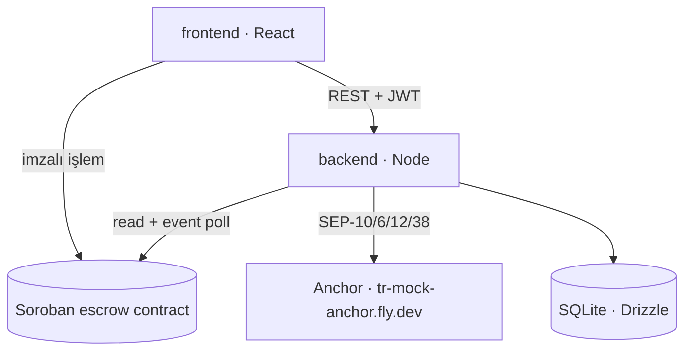
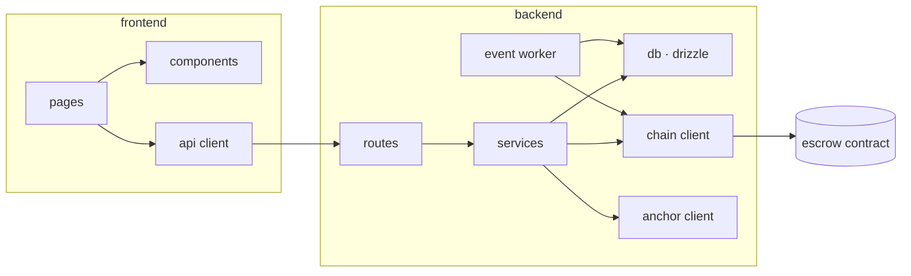
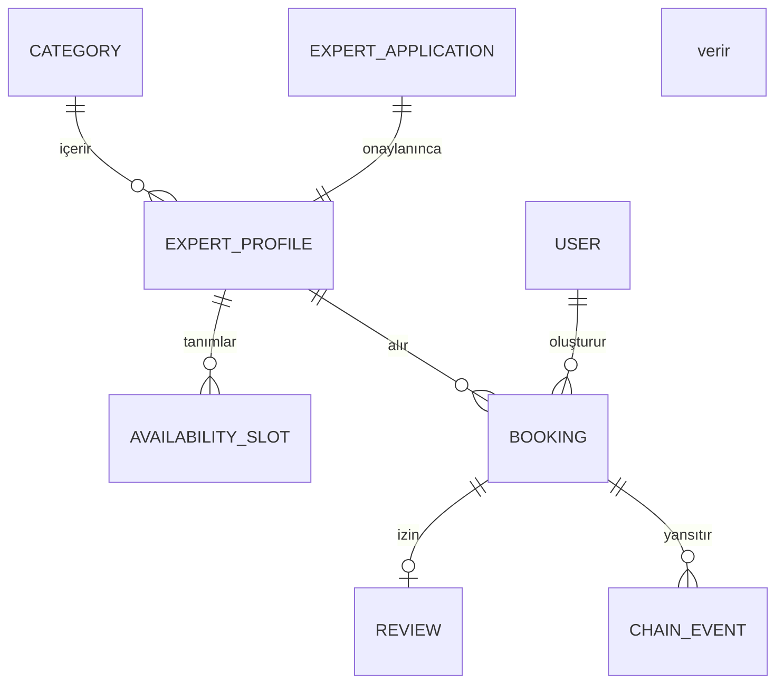

# Architecture Spine — Pactly

## Tasarım Paradigması

**Zincir-otoriteli katmanlı hizmet.** Para durumunun tek otoritesi Soroban contract'ıdır; backend bir aynadır ve zincirden okuduğunu yansıtır; frontend sunum ve imza katmanıdır.

| Katman | Dizin | Sorumluluk |
|---|---|---|
| Otorite | `contracts/escrow/` | Kaporanın kilitlenmesi, serbest bırakılması, iadesi ve bu geçişlerin event'leri |
| Ayna + orkestrasyon | `backend/` | Marketplace verisi, SEP akışları, zincir event'lerinin izlenmesi, randevu yaşam döngüsü |
| Sunum + imza | `frontend/` | Ekranlar, cüzdan imzası, durum gösterimi |
| Araçlar | `scripts/` | Testnet fonlama, trustline, deploy, örnek veri |

Katmanlar tek yönlü bağımlıdır: frontend → backend → contract. Frontend zincire yalnızca imza ve okuma için dokunur, contract'ın iş mantığını tekrar etmez.



## Değişmezler ve Kurallar

### AD-1 — Para durumunun otoritesi zincirdir

- **Binds:** tüm birimler, FR3, FR6, FR7, FR9, FR11
- **Prevents:** Backend ile contract'ın kapora durumu konusunda sessizce ayrışması; iki birimin farklı "gerçek" taşıması.
- **Rule:** Bir randevunun para durumu (`Locked` / `Released` / `Refunded`) yalnızca contract event'i işlendikten sonra veritabanına yazılır. Hiçbir kod yolu bu durumu event olmadan değiştiremez. Çakışmada zincir kazanır; DB düzeltilir.

### AD-2 — Zincir yetkileri: release imzalı, resolve_cancel izinsiz

- **Binds:** contract, Story 1.4, 1.5, 3.6
- **Prevents:** Backend'in kullanıcı adına para hareketi başlatması; no-show durumunda uzmanın kilitli kalması.
- **Rule:** `release(booking_id)` danışanın `require_auth`'unu ister. `resolve_cancel(booking_id)` izin gerektirmez; sonucu yalnızca `ledger.timestamp` ile `cancel_deadline` karşılaştırması belirler. Backend'in imza anahtarı hiçbir kapora fonksiyonunu çağıramaz.

### AD-3 — Randevu durumu iki eksenlidir

- **Binds:** backend, frontend, FR22, Story 3.5, 3.7
- **Prevents:** Kapora durumu ile kalan tutar durumunun tek alana sıkıştırılıp birbirini ezmesi.
- **Rule:** Randevu iki ayrı durum alanı taşır: `escrow_state` (zincirden gelir, AD-1) ve `balance_state` (`unpaid` / `paid_platform` / `paid_cash`, backend'den gelir). Hiçbir ekran ve API bunları tek alanda birleştirmez.

### AD-4 — Marketplace verisinin otoritesi backend'dir

- **Binds:** backend, frontend, FR12-FR21
- **Prevents:** Zincire ait olmayan verinin (kategori, profil, başvuru, değerlendirme) zincire yazılmaya çalışılması ve iki ayrı kayıt yerinin doğması.
- **Rule:** Kategori, uzman profili, başvuru, müsaitlik ve değerlendirme yalnızca veritabanında tutulur. Zincirde yalnızca kapora kaydı vardır. `verified_sessions` sayacı bu kuralın istisnası değildir: DB'de tutulur ama yalnızca `released` event'i ile artar (AD-1), elle yazılamaz.

### AD-5 — İki ayrı kimlik: Pactly oturumu ve anchor oturumu

- **Binds:** backend, frontend, FR10, FR15, Story 2.1
- **Prevents:** Bir birimin anchor JWT'sini Pactly oturumu sanması; anchor değişince girişin kırılması.
- **Rule:** Pactly kendi challenge'ını üretir ve kendi JWT'sini verir; yetkilendirme yalnızca bu token ile yapılır. Anchor JWT'si ayrı bir kimliktir, yalnızca SEP-6/12/38 çağrılarında kullanılır, backend'de saklanır ve frontend'e hiç verilmez.

### AD-6 — Cüzdan yalnızca ödeme anında; TL yolu yönetilen hesapla çalışır

- **Binds:** backend, frontend, FR4, FR15, Story 2.4, 3.4
- **Prevents:** Keşif ve profil ekranlarına giriş duvarı konması; TL ile ödeyen kullanıcının cüzdan kurmak zorunda kalması.
- **Rule:** Keşif, arama, profil ve fiyat görüntüleme kimlik doğrulaması gerektirmez. Kullanıcı cüzdanla öderse kapora kendi hesabından kilitlenir. TL ile öderse backend danışan adına yönetilen bir Stellar hesabı açar; SEP-6 deposit oraya düşer ve kapora oradan kilitlenir. Yönetilen hesabın anahtarı yalnızca kapora kilitlenene kadar kullanılır; serbest bırakma ve iade yine AD-2'ye tabidir.

### AD-7 — Tutarlar tamsayı olarak taşınır

- **Binds:** tüm birimler, NFR5
- **Prevents:** Kuruş kayması ve iki birimin farklı ondalık varsayımı.
- **Rule:** Zincirde ve API'de tutarlar en küçük birimde tamsayıdır (USDC için 7 ondalık, `i128`). JSON'da string olarak taşınır. Ondalık dönüşüm ve TL biçimlendirme yalnızca sunum katmanında yapılır. TRY karşılığı hiçbir yerde saklanmaz; SEP-38'den anlık alınır ve gösterildiği an damgalanır.

### AD-8 — Contract çağrıları tek bir sarmalayıcıdan geçer

- **Binds:** backend, Story 2.5
- **Prevents:** Farklı modüllerin kendi RPC istemcisini, kendi hata çevirisini ve kendi yeniden deneme mantığını kurması.
- **Rule:** Zincire tüm erişim `backend/src/chain/` altındaki tek istemci üzerinden yapılır. Contract hataları burada uygulama hatasına çevrilir. Başka hiçbir modül doğrudan RPC çağırmaz.

### AD-9 — Event işleme imleçli ve tekrar edilebilirdir

- **Binds:** backend, FR11
- **Prevents:** Event'in iki kez işlenip sayaçların şişmesi; yeniden başlatmada kayıp.
- **Rule:** Event okuyucu son işlenen ledger imlecini veritabanında tutar. Her event `(booking_id, event_type)` ile tekilleştirilir; aynı event ikinci kez işlendiğinde durum değişmez (idempotent). Backend yeniden başladığında imleçten devam eder.

### AD-10 — Anchor uçları keşifle bulunur

- **Binds:** backend, NFR2, Story 2.1
- **Prevents:** Endpoint'lerin koda gömülmesi ve mainnet geçişinde dağınık düzenleme.
- **Rule:** Tüm SEP uçları `stellar.toml` üzerinden okunur. Kodda yalnızca home domain ve network passphrase yapılandırılır.

### AD-11 — Kullanıcıya teknik terim sızmaz

- **Binds:** frontend, backend hata mesajları, NFR9
- **Prevents:** Hata yollarının ham zincir/SEP metinlerini ekrana basması.
- **Rule:** API hataları sabit bir zarf döner: `{ code, message, details? }`. `message` kullanıcıya gösterilebilir Türkçe metindir ve `EXPERIENCE.md`'deki dil kurallarına uyar. Ham zincir/anchor metinleri yalnızca `details` içinde ve yalnızca log'da kalır.

### AD-12 — Yetki kontrolü tek yerde

- **Binds:** backend, FR18, FR19, FR21
- **Prevents:** Her uç noktanın kendi rol kontrolünü uydurması.
- **Rule:** Üç rol vardır: `client`, `professional`, `admin`. Rol, Pactly JWT'sinden çözülür; admin listesi `PACTLY_ADMIN_WALLETS` ortam değişkeninden okunur. Yetki kontrolü route tanımında middleware ile yapılır, işleyici gövdesinde değil.

### AD-13 — Saat rezervasyonu zincirden önce backend'de tutulur

- **Binds:** backend, frontend, contract çağrısı, FR5, Story 3.4
- **Prevents:** İmza ile event arasındaki boşlukta aynı saatin iki kez satılması; iki birimin `booking_id`'yi farklı yerde üretmesi.
- **Rule:** Danışan ödemeye geçtiğinde backend bir *tutma kaydı* açar: `booking_id` (ULID) üretir, saati 10 dakika bloke eder ve randevuyu `pending_lock` durumunda yazar. Bu durum `escrow_state` değildir; AD-1 ihlal edilmez. Zincire yalnızca backend'in verdiği `booking_id` ile gidilir. `locked` event'i gelirse randevu `Locked` olur; süre dolarsa tutma kaydı düşer ve saat yeniden satışa açılır.

### AD-14 — Yönetilen hesaba düşen iade sahipsiz bırakılmaz

- **Binds:** backend, FR4, FR7, AD-6
- **Prevents:** TL ile ödeyip iade hakkı kazanan kullanıcının parasının, erişemediği bir hesapta kalması.
- **Rule:** Kapora yönetilen hesaptan kilitlendiyse iade de o hesaba döner. Backend `refunded` event'ini gördüğünde bu kullanıcı için SEP-6 withdraw akışını başlatır ve tutar kullanıcının bildirdiği banka hesabına gider. Yönetilen hesabın anahtarı yalnızca iki iş için kullanılır: kaporayı kilitlemek ve iadeyi TL olarak çıkarmak. Kullanıcı isterse iade yerine bakiyeyi kendi cüzdanına taşıyabilir.



Bağımlılık yönü tek yönlüdür. `services` katmanı `routes`'u, `db` katmanı `services`'i çağıramaz.

## Tutarlılık Sözleşmeleri

| Konu | Sözleşme |
|---|---|
| Adlandırma | Contract fonksiyonları ve event'ler `snake_case` (`create_booking`, `released`). TypeScript `camelCase`, tipler `PascalCase`. Dosya adları `kebab-case`. Veritabanı tabloları çoğul `snake_case` (`bookings`, `expert_applications`). |
| Kimlikler | `booking_id` zincir ile DB arasında ortak anahtardır, backend üretir (`ULID`), zincire `BytesN<16>` olarak yazılır. Diğer kayıtlar tamsayı birincil anahtar kullanır. |
| Tarih ve saat | Depolamada UTC epoch saniye (zincir ile aynı birim). API'de ISO 8601. Sunumda `Europe/Istanbul` ve Türkçe biçim. |
| Para | AD-7. API'de `{ amount: "6000000000", asset: "USDC" }` biçimi; TRY karşılığı ayrı alan ve `quotedAt` damgası ile. |
| Hata zarfı | AD-11. HTTP durum kodu + `{ code, message, details? }`. `code` sabit, makine tarafından okunur (`SLOT_TAKEN`, `AMOUNT_OUT_OF_RANGE`, `WALLET_REJECTED`). |
| Durum değişimi | Para durumu yalnızca event worker tarafından yazılır (AD-1). Diğer tüm yazmalar servis katmanından geçer; route'lar doğrudan DB'ye yazmaz. |
| Yapılandırma | Tüm ortam değişkenleri `backend/src/config.ts` içinde bir kez okunur ve doğrulanır; süreç başlarken eksik değişken varsa uygulama açılmaz. |
| Log | Sunucu tarafında yapısal JSON log; her istek `booking_id` ve `request_id` taşır. Zincir işlemlerinde hash her zaman loglanır. |
| Test | Contract: `cargo test` ile birim testleri (Story 1.6 zorunlu). Backend: SEP akışları ve event worker için entegrasyon testi. Frontend: test yerine demo akışının elle doğrulanması yeterli. |

## Stack

| Ad | Sürüm |
|---|---|
| Rust · soroban-sdk | 27.0.6 |
| Stellar CLI | geliştirme ortamındaki güncel sürüm |
| Node.js | 22 LTS |
| TypeScript | 5.x |
| Hono (backend HTTP) | 4.13.8 |
| Drizzle ORM | 0.45.2 |
| better-sqlite3 | 13.0.3 |
| @stellar/stellar-sdk | 17.1.0 |
| React | 19.x |
| Vite | 8.3.0 |
| @creit.tech/stellar-wallets-kit | 2.6.0 |
| @tanstack/react-query | 5.103.0 |
| motion (Framer Motion) | 13.3.0 |

Ağ: Stellar testnet (`Test SDF Network ; September 2015`). Anchor: `tr-mock-anchor.fly.dev`, varlık USDC.

## Yapısal Tohum

```text
pactly/
  contracts/escrow/      # Soroban contract: Booking, BookingState, create/release/resolve_cancel
  backend/
    src/
      config.ts          # ortam değişkenleri, tek okuma noktası
      routes/            # HTTP uçları + yetki middleware'i (AD-12)
      services/          # randevu, profil, başvuru, değerlendirme iş mantığı
      chain/             # tek contract istemcisi (AD-8) + event worker (AD-9)
      anchor/            # SEP-1/10/6/12/38 istemcisi (AD-10)
      db/                # drizzle şema ve migration
  frontend/
    src/
      pages/             # kesfet, uzman, rezervasyon, randevularim, panel, admin
      components/        # DESIGN.md bileşenleri
      api/               # backend istemcisi
      wallet/            # Stellar Wallets Kit sarmalayıcısı
  scripts/               # fonlama, trustline, deploy, örnek uzman verisi
```



`BOOKING` hem zincirdeki kaydın aynasıdır hem de zincirde olmayan alanları taşır: `balance_state` (AD-3), anchor işlem referansları, iptal ve onay zaman damgaları.

**Çalıştırma ortamı:** yalnızca local (`npm run dev`), contract testnet'te canlı. Dağıtım yapılmaz; demo canlı sunulur, yedek olarak video kaydı alınır. Gizli anahtarlar `.env` dosyasında kalır ve repoya girmez.

## Yetenek → Mimari Eşlemesi

| Alan | Nerede yaşar | Neye tabi |
|---|---|---|
| Kapora kilitleme, serbest bırakma, iade (FR3, FR6, FR7) | `contracts/escrow/` | AD-1, AD-2, AD-7, AD-14 |
| Randevu yaşam döngüsü, saat tutma, kalan tutar (FR5, FR22) | `backend/services/` | AD-1, AD-3, AD-13 |
| Keşif, arama, filtre, profil (FR12-FR16) | `backend/services/` + `frontend/pages/` | AD-4, AD-6 |
| Başvuru ve yönetim onayı (FR18, FR19) | `backend/routes/` + `services/` | AD-4, AD-12 |
| Doğrulanmış seans, değerlendirme (FR20, FR21) | `backend/services/` + event worker | AD-1, AD-4, AD-9 |
| TL yatırma ve çekme, kur (FR4, FR8, Story 2.2-2.4) | `backend/anchor/` | AD-5, AD-6, AD-10 |
| Kimlik ve oturum (FR10, FR15) | `backend/routes/auth` + `frontend/wallet/` | AD-5, AD-6, AD-12 |
| Ekranlar, durumlar, metinler (NFR8, NFR9, NFR10) | `frontend/` | AD-11, `DESIGN.md`, `EXPERIENCE.md` |

## Ertelenenler

- **Komisyon ve platform geliri.** PRD'de yok; contract'a dokunmayı gerektireceği için ürün kararı verilmeden açılmaz.
- **Uyuşmazlık çözümü (dispute).** İki taraf da haklı olduğunu iddia ederse ne olacağı tanımsız. Şu an kural tek: deadline. Hakemlik gerekirse contract'a yeni durum eklenmesi gerekir.
- **Mainnet geçişi.** AD-10 sayesinde home domain ve passphrase değişimiyle sınırlı kalmalı; gerçek geçiş hackathon sonrası.
- **USDT0 rayı.** PRD'de vizyon katmanı. Mimari varlık seçimini tek yerde tuttuğu için sonradan eklenebilir.
- **Dağıtım ve ölçekleme.** Local çalıştırma kararı verildi; deploy, kalıcı disk, yedekleme ve izleme bu spine'ın kapsamı dışında.
- **Bildirimler.** E-posta ya da anlık bildirim yok; kullanıcı durumu panelden görür.
- **Çoklu dil.** Arayüz yalnızca Türkçe. Metinler bileşenlerde gömülü olabilir.
- **Frontend test altyapısı.** İki günlük bütçede elle doğrulama tercih edildi.
