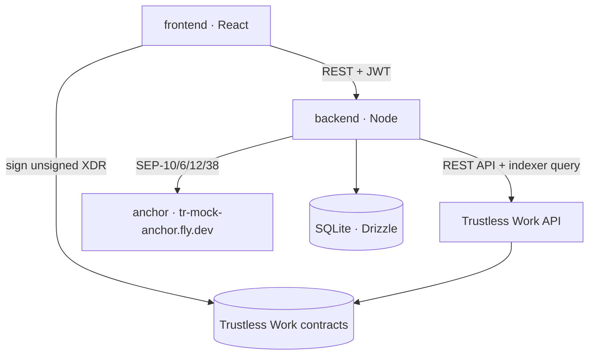
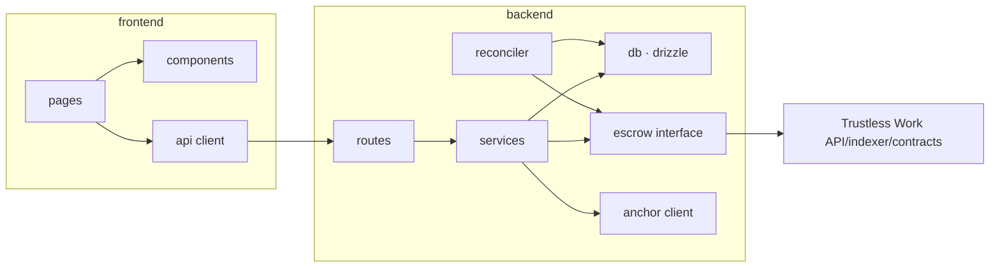
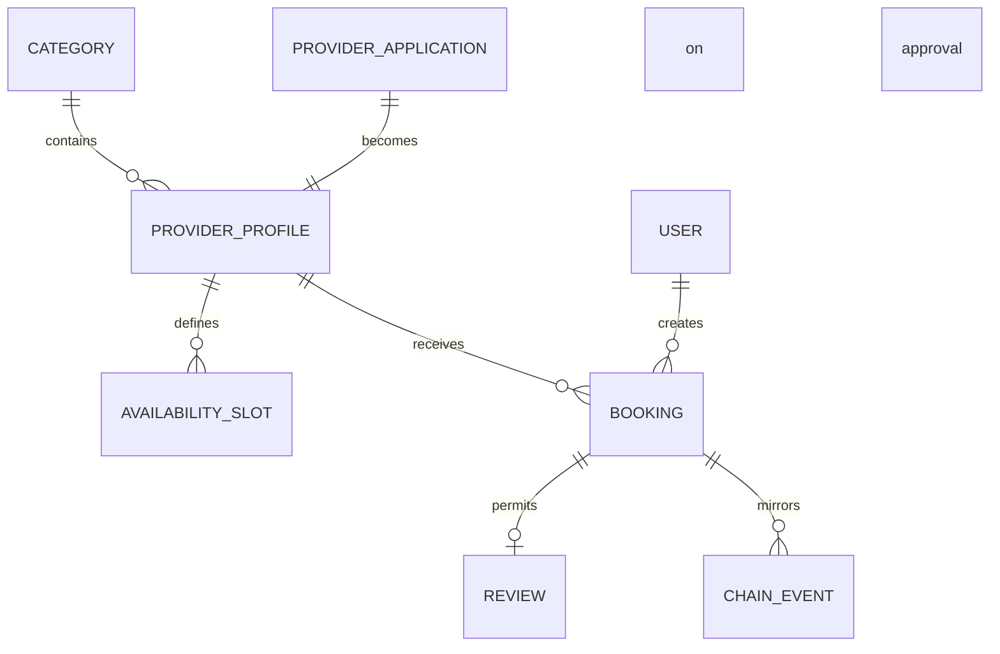

# Architecture Spine — Pactly

## Design Paradigm

**Trustless Work-authoritative layered services.** A version-pinned Trustless Work contract is the sole authority on money state; the backend is a mirror and appointment orchestrator; the frontend is presentation and role-correct signing.

| Layer | Directory | Responsibility |
|---|---|---|
| Authority | Trustless Work contracts | Funding, milestone approval, release, dispute and resolution |
| Mirror + orchestration | `backend/` | Marketplace data, appointment policy, SEP flows, Trustless Work adapter/reconciliation |
| Presentation + signing | `frontend/` | Screens, wallet signatures, state display |
| Reference | `contracts/escrow/` | Completed custom appointment-contract fallback; not the proposed MVP runtime |
| Tooling | `scripts/` | Testnet funding, trustlines, integration checks, seed data |

Dependencies run one way: frontend → Pactly backend → Trustless Work API/contract. The frontend signs unsigned XDR for the role it owns; it never restates escrow rules.



## Invariants & Rules

### AD-1 — The chain is the authority on money state

- **Binds:** all units, FR3, FR6, FR7, FR9, FR11
- **Prevents:** The backend and Trustless Work silently diverging on deposit state; two units carrying different truths.
- **Rule:** A booking's money state is written to the database only after corresponding Trustless Work/chain evidence is reconciled. No code path may settle it from an API request alone. On conflict the chain wins and the database is corrected.

### AD-2 — Trustless Work roles are explicit and least-privileged

- **Binds:** Stories 1.8, 2.6, 3.6, FR24
- **Prevents:** Pactly silently becoming the owner of every money action; the wrong user receiving unsigned XDR; product copy promising automatic policy enforcement that the selected role map does not provide.
- **Rule:** Every booking stores its Trustless Work funder, service provider, receiver, approver, release signer, platform and dispute resolver. The adapter returns unsigned XDR only to the signer assigned to the requested role. Any Pactly-controlled signer is documented as a trust assumption, not described as trustless.

### AD-3 — A booking carries two independent states

- **Binds:** backend, frontend, FR22, Story 3.5, 3.7
- **Prevents:** Deposit state and balance state being squeezed into one field where each overwrites the other.
- **Rule:** A booking carries two separate state fields: `escrow_state` (comes from chain, AD-1) and `balance_state` (`unpaid` / `paid_platform` / `paid_cash`, comes from the backend). No screen and no API response merges them into one field.

### AD-4 — The backend is the authority on marketplace data

- **Binds:** backend, frontend, FR12-FR21
- **Prevents:** Non-money data (categories, profiles, applications, reviews) being pushed on chain and creating a second record of truth.
- **Rule:** Categories, provider profiles, applications, availability, appointment policy and reviews live only in the database. Trustless Work holds escrow roles, funds, milestones and lifecycle flags. `verified_sessions` increments only after chain-backed evidence shows that the appointment milestone was approved and its escrow released. Provider cancellation counts remain backend-derived unless Story 1.8 identifies a distinct verifiable transition.

### AD-5 — Two separate identities: the Pactly session and the anchor session

- **Binds:** backend, frontend, FR10, FR15, Story 2.1
- **Prevents:** A unit mistaking the anchor JWT for the Pactly session; sign-in breaking when the anchor changes.
- **Rule:** Pactly issues its own challenge and its own JWT; authorization is done with that token only. The anchor JWT is a separate identity used only for SEP-6/12/38 calls, stored on the backend, and never handed to the frontend.

### AD-6 — The wallet appears only at payment; managed accounts sign only assigned roles

- **Binds:** backend, frontend, FR4, FR15, Story 2.4, 3.4
- **Prevents:** A sign-in wall in front of discovery and profiles; forcing a wallet on a client who pays in local currency.
- **Rule:** Discovery, search, profiles and prices require no authentication. A wallet payer funds Trustless Work from their own account. For local currency, a managed Stellar account receives the SEP-6 deposit and may sign only the Trustless Work roles explicitly assigned to that account. Story 1.8 must prove which later approval, release or resolution signatures the no-wallet path requires before it becomes a supported claim.

### AD-7 — Amounts travel as integers

- **Binds:** all units, NFR5
- **Prevents:** Rounding drift and two units assuming different decimal precision.
- **Rule:** Pactly stores and transports amounts as integers in the asset's smallest unit (7 decimals for USDC), encoded as strings in JSON. If the pinned Trustless Work API requires human-readable decimals, only the adapter converts at the boundary with exact decimal arithmetic; JavaScript floating point is forbidden. No fiat equivalent is persisted; it is fetched from SEP-38 and stamped with the quote time.

### AD-8 — Every Trustless Work call goes through one adapter

- **Binds:** backend, Story 2.5
- **Prevents:** Each module building its own RPC client, its own error translation and its own retry logic.
- **Rule:** Trustless Work REST, indexer, unsigned-XDR and direct chain reads go through `backend/src/escrow/trustless-work/`. Pactly services depend on an escrow interface, not vendor endpoints. Errors are translated there; no other module calls the Trustless Work API directly.

### AD-9 — Escrow reconciliation is cursored and idempotent

- **Binds:** backend, FR11
- **Prevents:** An event being processed twice and inflating counters; losing events on restart.
- **Rule:** The reconciler stores the last processed Trustless Work indexer/ledger cursor and deduplicates evidence by transaction hash plus lifecycle action. Repeated callbacks, index rows and polling results change nothing. On restart it resumes from the persisted cursor and corrects the database when chain evidence disagrees.

### AD-10 — Anchor endpoints are discovered, never hard-coded

- **Binds:** backend, NFR2, NFR12, Story 2.1
- **Prevents:** Endpoints scattered through the code and a messy mainnet migration; a second anchor requiring code changes.
- **Rule:** All SEP endpoints are read from `stellar.toml`. Only the home domain and the network passphrase are configured in code. The fiat currency is a property of the resolved anchor, never a constant in a module.

### AD-11 — Implementation vocabulary never reaches the user

- **Binds:** frontend, backend error paths, NFR9
- **Prevents:** Error paths printing raw chain or SEP text onto the screen.
- **Rule:** API errors return a fixed envelope: `{ code, message, details? }`. `message` is user-presentable English copy that follows the rules in `EXPERIENCE.md`. Raw chain and anchor text stays in `details` and in the logs.

### AD-12 — Authorization is enforced in one place

- **Binds:** backend, FR18, FR19, FR21
- **Prevents:** Every endpoint inventing its own role check.
- **Rule:** There are three roles: `client`, `provider`, `admin`. The role is resolved from the Pactly JWT; the admin list is read from the `PACTLY_ADMIN_WALLETS` environment variable. Authorization is applied as middleware in the route definition, never inside a handler body.

### AD-13 — The slot is held before Trustless Work initialization/funding

- **Binds:** backend, frontend, escrow initialization/funding, FR5, Story 3.4
- **Prevents:** The same slot being sold twice in the gap between signature and funding evidence; two units generating `booking_id` in different places.
- **Rule:** When the client moves to payment the backend opens a *hold*: it generates the `booking_id` (ULID), blocks the slot for 10 minutes and writes `pending_lock`. The same id is written into Trustless Work's engagement identifier. The booking becomes `Locked` only after initialize/fund evidence is reconciled; an expired unsigned hold returns the slot to sale.

### AD-14 — Funds returned to a managed account are never left stranded

- **Binds:** backend, FR4, FR7, AD-6
- **Prevents:** A client who paid in local currency being refunded into an account they cannot reach.
- **Rule:** If Trustless Work dispute resolution allocates funds back to a managed payer, chain-backed resolution evidence starts SEP-6 withdraw to the user's bank destination. A user may instead move the balance to their own wallet. The managed key may sign no operation outside the roles and transactions approved by Story 1.8.



Dependencies are one-way. `services` may not call `routes`; `db` may not call `services`.

## Consistency Conventions

| Concern | Convention |
|---|---|
| Language | All identifiers, comments, commit messages, documentation and user-facing copy are English (NFR11). |
| Naming | External Trustless Work field names stay at the adapter edge. Pactly TypeScript uses `camelCase`, types `PascalCase`; file names use `kebab-case`; database tables use plural `snake_case` (`bookings`, `provider_applications`). |
| Identifiers | `booking_id` is generated by Pactly (ULID) and used as the Trustless Work engagement identifier; Pactly also stores the returned escrow contract id. Other records use integer primary keys. |
| Dates and times | Stored as UTC epoch seconds (the chain's unit). ISO 8601 in the API. Rendered in the viewer's timezone with English formatting. |
| Money | AD-7. API shape `{ amount: "6000000000", asset: "USDC" }`; any fiat equivalent is a separate field carrying a `quotedAt` stamp and a currency code. |
| Error envelope | AD-11. HTTP status plus `{ code, message, details? }`. `code` is a stable machine-readable constant (`SLOT_TAKEN`, `AMOUNT_OUT_OF_RANGE`, `WALLET_REJECTED`). |
| State mutation | Money state is written only by the escrow reconciler from Trustless Work/chain evidence (AD-1). Every other write goes through the service layer; routes never write to the database directly. |
| Configuration | All environment variables are read and validated once in `backend/src/config.ts`; the process refuses to start when one is missing. |
| Logging | Structured JSON on the server; every request carries `booking_id` and `request_id`. Chain transactions always log their hash. |
| Testing | Legacy custom contract: retained `cargo test` regression suite. Runtime: Trustless Work adapter contract tests plus testnet integration for initialize/fund/complete/approve/release/dispute/resolve; SEP integration tests; manual frontend demo verification. |

## Stack

| Name | Version |
|---|---|
| Rust · soroban-sdk | 27.0.6 |
| Stellar CLI | current release in the dev environment |
| Node.js | 22 LTS |
| TypeScript | 5.x |
| Hono (backend HTTP) | 4.13.8 |
| Drizzle ORM | 0.45.2 |
| better-sqlite3 | 13.0.3 |
| @stellar/stellar-sdk | 17.1.0 |
| Trustless Work API / contract | Pinned by Story 1.8; never floating |
| React | 19.x |
| Vite | 8.3.0 |
| @creit.tech/stellar-wallets-kit | 2.6.0 |
| @tanstack/react-query | 5.103.0 |
| motion (Framer Motion) | 13.3.0 |

Network: Stellar testnet (`Test SDF Network ; September 2015`). Anchor: `tr-mock-anchor.fly.dev`, asset USDC.

## Structural Seed

```text
pactly/
  contracts/escrow/      # completed custom-contract reference/fallback, not proposed MVP runtime
  backend/
    src/
      config.ts          # environment variables, read in one place
      routes/            # HTTP endpoints + authorization middleware (AD-12)
      services/          # booking, profile, application and review logic
      escrow/
        interface.ts     # vendor-neutral booking escrow boundary
        trustless-work/  # REST, indexer, XDR adapter + reconciliation (AD-8, AD-9)
      anchor/            # SEP-1/10/6/12/38 client (AD-10)
      db/                # drizzle schema and migrations
  frontend/
    src/
      pages/             # discover, provider, booking, my-bookings, panel, admin
      components/        # the components defined in DESIGN.md
      api/               # backend client
      wallet/            # Stellar Wallets Kit wrapper
  scripts/               # funding, trustlines, deployment, seed providers
```



`BOOKING` mirrors the Trustless Work engagement and also carries what the escrow does not: slot, appointment policy, `balance_state` (AD-3), anchor references, contract id, role addresses and appointment timestamps.

**Runtime environment:** local only (`npm run dev`), with the contract live on testnet. Nothing is deployed; the demo is presented live with a recorded video as backup. Secrets stay in `.env` and never enter the repository.

## Capability → Architecture Map

| Area | Lives in | Governed by |
|---|---|---|
| Funding, approving, releasing and resolving the deposit (FR3, FR6, FR7) | Trustless Work via `backend/src/escrow/trustless-work/` | AD-1, AD-2, AD-7, AD-8, AD-14 |
| Booking lifecycle, slot holds, balance (FR5, FR22) | `backend/services/` | AD-1, AD-3, AD-13 |
| Discovery, search, filters, profiles (FR12-FR16) | `backend/services/` + `frontend/pages/` | AD-4, AD-6 |
| Applications and admin approval (FR18, FR19) | `backend/routes/` + `services/` | AD-4, AD-12 |
| Verified sessions, reviews (FR20, FR21) | `backend/services/` + escrow reconciler | AD-1, AD-4, AD-9 |
| Local-currency deposit, withdrawal, quotes (FR4, FR8, Story 2.2-2.4) | `backend/anchor/` | AD-5, AD-6, AD-10 |
| Identity and session (FR10, FR15) | `backend/routes/auth` + `frontend/wallet/` | AD-5, AD-6, AD-12 |
| Screens, states, copy (NFR8, NFR9, NFR10, NFR11) | `frontend/` | AD-11, `DESIGN.md`, `EXPERIENCE.md` |

## Deferred

- **Commission and platform revenue.** Not in the PRD; it would touch the contract, so it stays closed until there is a product decision.
- **Automatic appointment-policy enforcement.** Deadline refunds, provider cancellations and no-show forfeiture are unsupported product claims until Story 1.8 proves whether they are on-chain, externally orchestrated or unavailable in the pinned Trustless Work revision.
- **Mainnet migration.** AD-10 should keep it to a home domain and passphrase change; the real migration comes after the hackathon.
- **Cross-chain assets.** The MVP story is cross-border escrow over USDC and anchor rails, not bridge coverage.
- **Additional anchors and currencies.** NFR12 forbids hard-coding TRY, but how a user's anchor gets selected is an open product question.
- **Deployment and scaling.** Local-only was decided; deployment, persistent disks, backups and monitoring are outside this spine.
- **Notifications.** No email or push; users read state from the panel.
- **Localization beyond English.** The interface ships in English only; copy may live inline in components.
- **Frontend test infrastructure.** Manual verification was chosen for the two-day budget.
