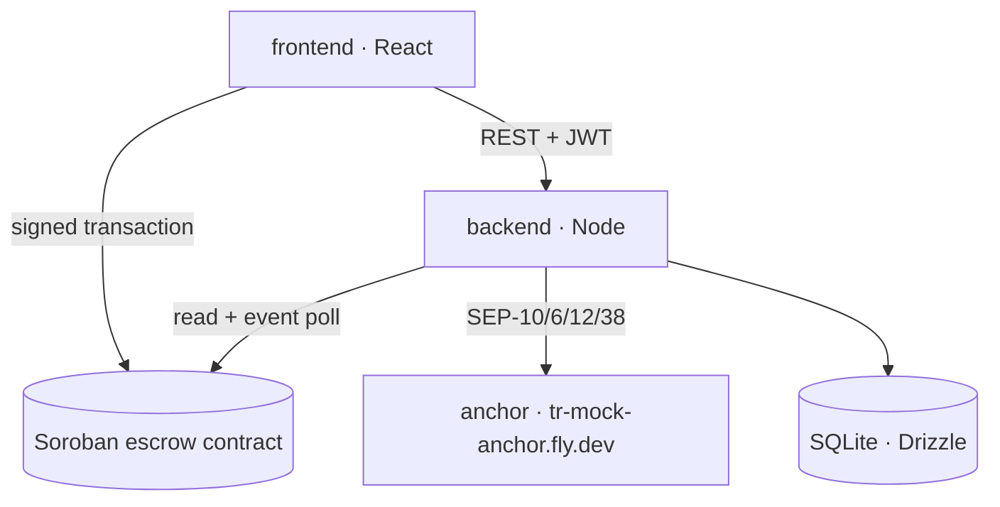
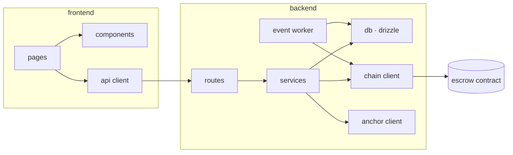
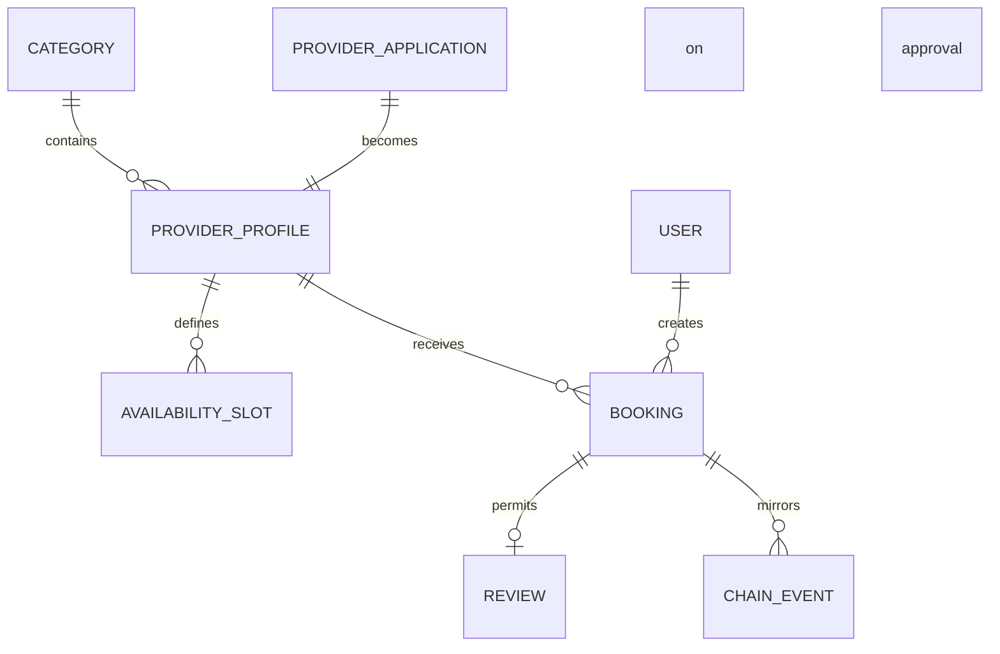

# Architecture Spine — Pactly

## Design Paradigm

**Chain-authoritative layered services.** The Soroban contract is the sole authority on money state; the backend is a mirror that reflects what it reads from chain; the frontend is presentation and signing.

| Layer | Directory | Responsibility |
|---|---|---|
| Authority | `contracts/escrow/` | Locking, releasing and refunding the deposit, and emitting those transitions |
| Mirror + orchestration | `backend/` | Marketplace data, SEP flows, chain event ingestion, booking lifecycle |
| Presentation + signing | `frontend/` | Screens, wallet signatures, state display |
| Tooling | `scripts/` | Testnet funding, trustlines, deployment, seed data |

Dependencies run one way: frontend → backend → contract. The frontend touches the chain only to sign and to read; it never restates the contract's business logic.



## Invariants & Rules

### AD-1 — The chain is the authority on money state

- **Binds:** all units, FR3, FR6, FR7, FR9, FR11
- **Prevents:** The backend and the contract silently diverging on deposit state; two units carrying different truths.
- **Rule:** A booking's money state (`Locked` / `Released` / `Refunded`) is written to the database only after the corresponding contract event is processed. No code path may set that state without an event. On conflict the chain wins and the database is corrected.

### AD-2 — On-chain authority: release is signed, resolve_cancel is permissionless

- **Binds:** contract, Story 1.4, 1.5, 3.6
- **Prevents:** The backend moving money on a user's behalf; the provider being stuck when a client no-shows.
- **Rule:** `release(booking_id)` requires the client's `require_auth`. `resolve_cancel(booking_id)` requires no authorization; its outcome is decided solely by comparing `ledger.timestamp` with `cancel_deadline`. The backend's signing key may not call any deposit function.

### AD-3 — A booking carries two independent states

- **Binds:** backend, frontend, FR22, Story 3.5, 3.7
- **Prevents:** Deposit state and balance state being squeezed into one field where each overwrites the other.
- **Rule:** A booking carries two separate state fields: `escrow_state` (comes from chain, AD-1) and `balance_state` (`unpaid` / `paid_platform` / `paid_cash`, comes from the backend). No screen and no API response merges them into one field.

### AD-4 — The backend is the authority on marketplace data

- **Binds:** backend, frontend, FR12-FR21
- **Prevents:** Non-money data (categories, profiles, applications, reviews) being pushed on chain and creating a second record of truth.
- **Rule:** Categories, provider profiles, applications, availability and reviews live only in the database. The chain holds only the deposit record. The `verified_sessions` counter is no exception: it is stored in the database but only ever incremented by a `released` event (AD-1) and never written by hand.

### AD-5 — Two separate identities: the Pactly session and the anchor session

- **Binds:** backend, frontend, FR10, FR15, Story 2.1
- **Prevents:** A unit mistaking the anchor JWT for the Pactly session; sign-in breaking when the anchor changes.
- **Rule:** Pactly issues its own challenge and its own JWT; authorization is done with that token only. The anchor JWT is a separate identity used only for SEP-6/12/38 calls, stored on the backend, and never handed to the frontend.

### AD-6 — The wallet appears only at payment; the local-currency path uses a managed account

- **Binds:** backend, frontend, FR4, FR15, Story 2.4, 3.4
- **Prevents:** A sign-in wall in front of discovery and profiles; forcing a wallet on a client who pays in local currency.
- **Rule:** Discovery, search, profiles and prices require no authentication. When the client pays from a wallet, the deposit is locked from their own account. When they pay in local currency, the backend opens a managed Stellar account on their behalf; the SEP-6 deposit lands there and the escrow is locked from it. The managed account's key is used only until the deposit is locked; release and refund remain bound by AD-2.

### AD-7 — Amounts travel as integers

- **Binds:** all units, NFR5
- **Prevents:** Rounding drift and two units assuming different decimal precision.
- **Rule:** On chain and in the API, amounts are integers in the asset's smallest unit (7 decimals for USDC, `i128`). JSON carries them as strings. Decimal conversion and currency formatting happen only in the presentation layer. No fiat equivalent is ever persisted; it is fetched from SEP-38 and stamped with the moment it was quoted.

### AD-8 — Every contract call goes through one wrapper

- **Binds:** backend, Story 2.5
- **Prevents:** Each module building its own RPC client, its own error translation and its own retry logic.
- **Rule:** All chain access goes through the single client under `backend/src/chain/`. Contract errors are translated to application errors there. No other module calls RPC directly.

### AD-9 — Event processing is cursored and idempotent

- **Binds:** backend, FR11
- **Prevents:** An event being processed twice and inflating counters; losing events on restart.
- **Rule:** The event reader keeps the last processed ledger cursor in the database. Every event is deduplicated by `(booking_id, event_type)`; processing the same event again changes nothing. On restart the backend resumes from the cursor.

### AD-10 — Anchor endpoints are discovered, never hard-coded

- **Binds:** backend, NFR2, NFR12, Story 2.1
- **Prevents:** Endpoints scattered through the code and a messy mainnet migration; a second anchor requiring code changes.
- **Rule:** All SEP endpoints are read from `stellar.toml`. Only the home domain and the network passphrase are configured in code. The fiat currency is a property of the resolved anchor, never a constant in a module.

### AD-11 — Implementation vocabulary never reaches the user

- **Binds:** frontend, backend error paths, NFR9
- **Prevents:** Error paths printing raw chain or SEP text onto the screen.
- **Rule:** API errors return a fixed envelope: `{ code, message, details? }`. `message` is user-presentable English copy that follows the rules in `EXPERIENCE.md`. Raw chain and anchor text stays in `details` and in the logs.

### AD-12 — Authorization is enforced in one place

- **Binds:** backend, FR18, FR19, FR21
- **Prevents:** Every endpoint inventing its own role check.
- **Rule:** There are three roles: `client`, `provider`, `admin`. The role is resolved from the Pactly JWT; the admin list is read from the `PACTLY_ADMIN_WALLETS` environment variable. Authorization is applied as middleware in the route definition, never inside a handler body.

### AD-13 — The slot is held by the backend before the chain call

- **Binds:** backend, frontend, contract call, FR5, Story 3.4
- **Prevents:** The same slot being sold twice in the gap between signature and event; two units generating `booking_id` in different places.
- **Rule:** When the client moves to payment the backend opens a *hold*: it generates the `booking_id` (ULID), blocks the slot for 10 minutes and writes the booking in the `pending_lock` state. That state is not an `escrow_state`, so AD-1 still holds. The chain is only ever called with the backend's `booking_id`. On a `locked` event the booking becomes `Locked`; if the hold expires, it is dropped and the slot returns to sale.

### AD-14 — A refund into a managed account is never left stranded

- **Binds:** backend, FR4, FR7, AD-6
- **Prevents:** A client who paid in local currency being refunded into an account they cannot reach.
- **Rule:** If the deposit was locked from a managed account, the refund returns there. On the `refunded` event the backend starts a SEP-6 withdraw for that user and the money goes to the bank account they provided. The managed account's key is used for exactly two jobs: locking the deposit and paying a refund out. A user may instead move the balance to their own wallet.



Dependencies are one-way. `services` may not call `routes`; `db` may not call `services`.

## Consistency Conventions

| Concern | Convention |
|---|---|
| Language | All identifiers, comments, commit messages, documentation and user-facing copy are English (NFR11). |
| Naming | Contract functions and events are `snake_case` (`create_booking`, `released`). TypeScript uses `camelCase`, types `PascalCase`. File names are `kebab-case`. Database tables are plural `snake_case` (`bookings`, `provider_applications`). |
| Identifiers | `booking_id` is the shared key between chain and database; the backend generates it (ULID) and writes it on chain as `BytesN<16>`. Other records use integer primary keys. |
| Dates and times | Stored as UTC epoch seconds (the chain's unit). ISO 8601 in the API. Rendered in the viewer's timezone with English formatting. |
| Money | AD-7. API shape `{ amount: "6000000000", asset: "USDC" }`; any fiat equivalent is a separate field carrying a `quotedAt` stamp and a currency code. |
| Error envelope | AD-11. HTTP status plus `{ code, message, details? }`. `code` is a stable machine-readable constant (`SLOT_TAKEN`, `AMOUNT_OUT_OF_RANGE`, `WALLET_REJECTED`). |
| State mutation | Money state is written only by the event worker (AD-1). Every other write goes through the service layer; routes never write to the database directly. |
| Configuration | All environment variables are read and validated once in `backend/src/config.ts`; the process refuses to start when one is missing. |
| Logging | Structured JSON on the server; every request carries `booking_id` and `request_id`. Chain transactions always log their hash. |
| Testing | Contract: unit tests via `cargo test` (Story 1.6, mandatory). Backend: integration tests for the SEP flows and the event worker. Frontend: manual verification of the demo flow instead of a test suite. |

## Stack

| Name | Version |
|---|---|
| Rust · soroban-sdk | 27.0.6 |
| Stellar CLI | current release in the dev environment |
| Node.js | 22 LTS |
| TypeScript | 5.x |
| Hono (backend HTTP) | 4.13.8 |
| Drizzle ORM | 0.45.2 |
| better-sqlite3 | 13.0.3 |
| @stellar/stellar-sdk | 17.1.0 |
| React | 19.x |
| Vite | 8.3.0 |
| @creit.tech/stellar-wallets-kit | 2.6.0 |
| @tanstack/react-query | 5.103.0 |
| motion (Framer Motion) | 13.3.0 |

Network: Stellar testnet (`Test SDF Network ; September 2015`). Anchor: `tr-mock-anchor.fly.dev`, asset USDC.

## Structural Seed

```text
pactly/
  contracts/escrow/      # Soroban contract: Booking, BookingState, create/release/resolve_cancel
  backend/
    src/
      config.ts          # environment variables, read in one place
      routes/            # HTTP endpoints + authorization middleware (AD-12)
      services/          # booking, profile, application and review logic
      chain/             # the single contract client (AD-8) + event worker (AD-9)
      anchor/            # SEP-1/10/6/12/38 client (AD-10)
      db/                # drizzle schema and migrations
  frontend/
    src/
      pages/             # discover, provider, booking, my-bookings, panel, admin
      components/        # the components defined in DESIGN.md
      api/               # backend client
      wallet/            # Stellar Wallets Kit wrapper
  scripts/               # funding, trustlines, deployment, seed providers
```



`BOOKING` mirrors the on-chain record and also carries what the chain does not: `balance_state` (AD-3), anchor transaction references, and cancellation and confirmation timestamps.

**Runtime environment:** local only (`npm run dev`), with the contract live on testnet. Nothing is deployed; the demo is presented live with a recorded video as backup. Secrets stay in `.env` and never enter the repository.

## Capability → Architecture Map

| Area | Lives in | Governed by |
|---|---|---|
| Locking, releasing and refunding the deposit (FR3, FR6, FR7) | `contracts/escrow/` | AD-1, AD-2, AD-7, AD-14 |
| Booking lifecycle, slot holds, balance (FR5, FR22) | `backend/services/` | AD-1, AD-3, AD-13 |
| Discovery, search, filters, profiles (FR12-FR16) | `backend/services/` + `frontend/pages/` | AD-4, AD-6 |
| Applications and admin approval (FR18, FR19) | `backend/routes/` + `services/` | AD-4, AD-12 |
| Verified sessions, reviews (FR20, FR21) | `backend/services/` + event worker | AD-1, AD-4, AD-9 |
| Local-currency deposit, withdrawal, quotes (FR4, FR8, Story 2.2-2.4) | `backend/anchor/` | AD-5, AD-6, AD-10 |
| Identity and session (FR10, FR15) | `backend/routes/auth` + `frontend/wallet/` | AD-5, AD-6, AD-12 |
| Screens, states, copy (NFR8, NFR9, NFR10, NFR11) | `frontend/` | AD-11, `DESIGN.md`, `EXPERIENCE.md` |

## Deferred

- **Commission and platform revenue.** Not in the PRD; it would touch the contract, so it stays closed until there is a product decision.
- **Dispute resolution.** What happens when both sides claim to be right is undefined. Today the only rule is the deadline. Arbitration would require a new contract state.
- **Mainnet migration.** AD-10 should keep it to a home domain and passphrase change; the real migration comes after the hackathon.
- **The USDT0 rail.** A vision layer in the PRD. The architecture keeps asset selection in one place so it can be added later.
- **Additional anchors and currencies.** NFR12 forbids hard-coding TRY, but how a user's anchor gets selected is an open product question.
- **Deployment and scaling.** Local-only was decided; deployment, persistent disks, backups and monitoring are outside this spine.
- **Notifications.** No email or push; users read state from the panel.
- **Localization beyond English.** The interface ships in English only; copy may live inline in components.
- **Frontend test infrastructure.** Manual verification was chosen for the two-day budget.
