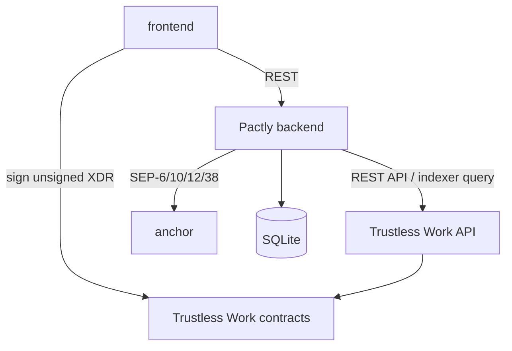

# Sprint Change Proposal — Trustless Work Integration

## 1. Issue Summary

### Trigger

Stakeholder feedback on 2026-09-19 identified three product and judging risks:

1. **“Lock with Pactly” is the strongest product moment** and should be the center of the demo and interface.
2. The current pitch does not answer “why does this need crypto?” tightly enough.
3. Pactly should integrate **Trustless Work** rather than present a new custom escrow contract as its main technical contribution.

The trigger was not a failed implementation story. It was external product feedback after Epic 1 had already implemented and tested a custom Soroban escrow and Story 2.5 had started building its chain adapter.

### Evidence

Raven research on 2026-09-19 found:

- Trustless Work is a live Stellar escrow infrastructure project, an SCF Integration Track building block, and an SCF-funded project.
- It provides single-release and multi-release escrow contracts, REST APIs, React integration, unsigned-XDR signing, role-based approvals, releases, and dispute resolution.
- Runtime Verification audited the Smart Escrow Platform. The indexed project record also shows code changes after the audit, so Pactly may say “audited infrastructure” only with version-qualified wording; it must not imply that every current revision is covered by the audit.
- Trustless Work’s documented lifecycle is milestone-based: service provider completion, approver approval, release signer release, and dispute-resolver allocation.
- The reviewed material does **not** establish native on-chain appointment deadlines, automatic early-cancellation refunds, provider-cancellation refunds, or automatic no-show forfeiture.

### Core Problem

The current PRD promises appointment-specific automatic settlement enforced by Pactly’s custom contract. Trustless Work reduces custom-contract risk and aligns with stakeholder expectations, but its generic milestone lifecycle does not directly prove all four current settlement paths. Adopting it therefore requires an MVP redefinition, not a package swap.

## 2. Checklist Findings

### Trigger and Context

- [x] 1.1 Trigger identified: stakeholder/jury feedback after Epic 1 and during Epic 2.
- [x] 1.2 Type: strategic pivot plus external integration requirement.
- [x] 1.3 Evidence collected from feedback, current artifacts, Raven project/repository records, Trustless Work documentation, and the Runtime Verification audit.

### Epic Impact

- [!] 2.1 Epic 1 cannot remain the active runtime foundation as written. Its completed custom-contract work becomes prior art/fallback until compatibility is proven.
- [x] 2.2 Epic 1 gains a Trustless Work compatibility and role-mapping story; no completed history is erased.
- [!] 2.3 Epic 2 Story 2.5’s chain adapter and event assumptions must change from custom function/event names to Trustless Work API/indexer state.
- [x] 2.4 Epics 3 and 4 remain useful, but settlement copy, status states, verified-session derivation, and the demo scenario require updates.
- [x] 2.5 Priority changes: compatibility spike and “Lock with Pactly” happy path move ahead of advanced marketplace breadth.

### Artifact Impact

- [!] 3.1 PRD conflicts: FR3, FR6, FR7, FR11; NFR5; repository layout; service architecture; test requirements; Epic 1; Stories 2.5, 3.4, 3.6, 3.8; USDT0 section.
- [!] 3.2 Architecture conflicts: authority component, AD-2, AD-4, AD-6, AD-8, AD-9, AD-13, AD-14, diagrams, stack, structural seed, capability map, deferred disputes.
- [!] 3.3 UX conflicts: one-signature promise, automatic cancellation copy, escrow state vocabulary, confirmation journey, and the current therapy-first demo. The “Lock with Pactly” component and escrow proof become more prominent.
- [!] 3.4 Secondary impact: custom-contract setup scripts, contract unit tests, chain client tests, environment variables, README, demo script, and sprint status.

## 3. Options Evaluated

### Option 1 — Direct Replacement

Replace the custom contract immediately with Trustless Work and keep every existing behavior claim.

- Effort: medium
- Risk: high
- Verdict: **not viable**

Reason: current evidence does not prove automatic deadline/refund/no-show semantics. Keeping those claims would be technically unsupported.

### Option 2 — Roll Back Epic 1

Delete or revert the completed custom contract and its tests before integrating Trustless Work.

- Effort: medium
- Risk: high
- Verdict: **not recommended**

Reason: deletion loses useful executable requirements and creates unnecessary churn before integration compatibility is demonstrated.

### Option 3 — MVP Review

Use Trustless Work for the lock → complete → approve → release happy path; describe cancellation and no-show as dispute/resolution paths until automatic appointment rules are proven.

- Effort: medium
- Risk: medium
- Verdict: **viable**

### Recommended Hybrid

Combine Option 3 with a compatibility gate:

1. Preserve the custom contract as non-runtime fallback/reference.
2. Add a time-boxed Trustless Work compatibility story.
3. Make Trustless Work the runtime only after lock, release, refund/dispute, role, fee, event/indexer, testnet, and managed-account paths are verified.
4. Narrow the MVP to the verifiable happy path and honest dispute behavior.
5. Remove USDT0 from the product story.

This best aligns judging value, implementation time, and technical truth.

## 4. Detailed Change Proposals

### PRD — Positioning

**Current**

> Pactly locks the deposit in neutral escrow: it releases to the professional when the appointment happens and resolves according to the cancellation policy when it does not.

**Proposed**

> Pactly turns Trustless Work’s programmable Stellar escrow into an appointment-booking experience. A client locks a deposit without sending it directly to the provider. After the appointment, the parties approve and release it through a verifiable escrow workflow; disagreements enter a visible dispute flow.

Add the explicit crypto rationale:

> Bank transfers move money, but do not hold it neutrally or enforce a shared release workflow. Stellar provides a global stablecoin rail and verifiable authorization; Trustless Work provides the escrow roles and contract lifecycle; Pactly makes them usable for appointments and local-currency settlement.

Use a cross-border, high-deposit physical appointment as the hero scenario:

> A client abroad reserves a hair-transplant consultation or procedure day in Istanbul without wiring a large deposit directly to an unfamiliar clinic.

The product remains vertical-agnostic; therapy, salons, barbers, and clinics remain marketplace examples.

### PRD — Functional Requirements

**FR3**

- OLD: Pactly’s Soroban contract locks the deposit.
- NEW: Pactly initializes and funds a Trustless Work single-release escrow identified by the booking id; neither Pactly nor the provider receives the locked principal.

**FR6**

- OLD: Session confirmation calls the custom `release`.
- NEW: The provider records completion, the designated approver approves the appointment milestone, and the designated release signer releases funds through Trustless Work.

**FR7**

- OLD: Four custom contract paths automatically settle by actor and deadline.
- NEW: MVP cancellation and no-show outcomes use Trustless Work dispute/resolution roles. Pactly must state the predicted outcome before opening the dispute, but must not claim the generic Trustless Work contract automatically enforces appointment deadlines unless the compatibility story proves it.

**FR11**

- OLD: Consume custom `locked`, `released`, `refunded`, `cancelled`, and `forfeited` events.
- NEW: Reconcile booking money state from Trustless Work contract/indexer records and transaction hashes. Database state remains a mirror, never the authority.

Add:

- **FR24:** Every booking maps Pactly roles to Trustless Work roles explicitly: funder, service provider, receiver, approver, release signer, platform, and dispute resolver.
- **FR25:** The booking detail displays “Escrow powered by Trustless Work on Stellar” and a verifiable transaction/contract link.
- **FR26:** “Lock with Pactly” is the primary booking action and the central demo moment.

### PRD — Non-Functional and Technical Assumptions

- Replace custom-contract integer-overflow NFR with version-pinned Trustless Work API/contract integration and integer-safe Pactly amount handling.
- Replace mandatory custom contract unit tests with:
  - adapter contract tests against recorded Trustless Work payloads,
  - testnet integration tests for initialize/fund/approve/release/dispute,
  - reconciliation tests against indexer/chain state,
  - role and wrong-signer tests.
- Remove the USDT0 section from MVP and roadmap narrative.
- Keep USDC + SEP-6/SEP-38 as the demonstrated rail.
- Add Trustless Work API base URL, API key, network, asset contract, platform address, and role addresses to validated configuration.
- Change repository layout responsibility:
  - `contracts/escrow/` becomes legacy/reference until deleted by a later explicit decision.
  - `backend/src/escrow/trustless-work/` becomes the runtime adapter.

### Epic and Story Changes

#### Epic 1

Rename to **Foundation and Escrow Validation**.

Preserve Stories 1.1–1.7 as completed implementation history. Add:

**Story 1.8 — Trustless Work appointment compatibility**

Acceptance criteria:

1. A testnet single-release escrow can be initialized and funded with USDC.
2. Pactly’s seven role assignments are documented and exercised.
3. Complete → approve → release succeeds end to end.
4. Dispute → resolve can send the documented allocation to client/provider.
5. Required signatures and transaction count are measured for wallet and managed-account paths.
6. Fees, indexer visibility, API limits, API authentication, contract revision, and audit coverage are recorded.
7. Deadline-based automatic refund/no-show support is explicitly classified as supported, externally orchestrated, or unsupported.
8. A go/no-go decision names which user-facing claims are valid.

#### Epic 2

Story 2.5 remains the generic service/data foundation, but its custom chain wrapper is superseded.

Add:

**Story 2.6 — Trustless Work escrow adapter and reconciliation**

1. All Trustless Work calls pass through one adapter.
2. Unsigned XDR is returned only to the wallet/managed signer assigned to that role.
3. Booking state is reconciled from Trustless Work contract/indexer state.
4. Retries and duplicate callbacks are idempotent.
5. Raw API/contract errors never reach product copy.

#### Epic 3

- Story 3.4 CTA becomes **Lock with Pactly**.
- Story 3.5 states map to Trustless Work lifecycle states.
- Story 3.6 becomes complete/approve/release plus dispute initiation/resolution.
- Story 3.8 hero demo changes to a cross-border physical appointment with a meaningful deposit; therapy remains a secondary sample.

#### Epic 4

- Verified sessions increment only after a successful release tied to an approved appointment milestone.
- Provider cancellation count is backend-derived unless Trustless Work exposes a distinct, verifiable cancellation transition.

### Architecture

Change the authority boundary from “Pactly custom contract” to “version-pinned Trustless Work contract state.”

New primary flow:

The backend may orchestrate workflow but may not write a settled state without Trustless Work/chain evidence.

### UX

- Keep **Lock with Pactly** as the sole money-commit CTA.
- Add secondary proof copy: **Escrow powered by Trustless Work on Stellar**.
- Replace “the contract automatically decides” with accurate lifecycle copy.
- Keep transaction proof and escrow visibility.
- Do not expose milestone jargon in the consumer interface; use “Appointment completed,” “Approve release,” and “Needs resolution.”
- Make the high-deposit cross-border clinic scenario the demo climax.

## 5. Scope, Sequence, and Handoff

### Classification

**Major** — fundamental replan across product, architecture, UX behavior, and completed escrow work.

### Sequence

1. Approve this proposal.
2. Update PRD to v1.3.
3. Update architecture and UX behavior contracts.
4. Add Stories 1.8 and 2.6 to sprint status.
5. Run Story 1.8 before removing or bypassing the custom runtime.
6. Implement Story 2.6.
7. Update README and demo script.
8. Only then decide whether `contracts/escrow/` is archived, retained as fallback, or deleted.

### Ownership

- Product/PM: PRD positioning, MVP claims, demo scenario.
- Architect: role map, authority boundary, reconciliation, managed signer risk.
- Developer: compatibility spike, adapter, tests, config, and migration.
- UX: Lock with Pactly centerpiece, Trustless Work proof copy, dispute states.

### Success Criteria

- A booking deposit is initialized and funded through Trustless Work on testnet.
- The happy path releases through role-correct signed transactions.
- Pactly displays verifiable escrow proof.
- The demo never claims an automatic behavior that Trustless Work does not enforce.
- USDT0 is absent from the MVP pitch.
- The provider receives local currency through the existing anchor plan.

## 6. Risks and Open Decisions

1. **Automatic appointment policy:** unresolved until Story 1.8.
2. **Signer UX:** approval and release may require more than one transaction.
3. **Platform trust:** assigning Pactly as release signer or dispute resolver weakens “no middleman decides”; copy must reflect the selected role map.
4. **Audit drift:** version pinning is mandatory because code changed after the indexed audit.
5. **Fees:** Trustless Work protocol fees and Pactly platform fees must be measured before showing net provider proceeds.
6. **Managed accounts:** backend-held signing authority requires a dedicated security review before production claims.

